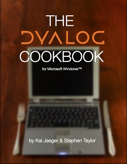

The Dyalog Cookbook
===================

A guide to organising, shipping and maintaining an application in [Dyalog APL](http://dyalog.com).

Written by Kai Jaeger (<https://aplteam.com>) and Stephen Taylor (<http://lambenttechnology.com/>) and sponsored by Dyalog Ltd (<https://www.dyalog.com>).

This is an open-source project. You are invited to contribute using the [Forked Workflow model](https://www.atlassian.com/git/tutorials/comparing-workflows/forking-workflow): fork this repository to your own account, make changes and lodge a pull request to include your changes. 

Alternatively, write to Kai (<mailto:kai@aplteam.com>) or Stephen (<mailto:sjt@5jt.com>). 

The project requires Dyalog APL Unicode 16.0 or later. 

The manuscript is written in Markdown and converted into HTML5 by a program written in Dyalog APL. 

The project contains various child folders and files; the principle ones are listed here:

`code/`
: scripts corresponding to different versions of the MyApp application

`manuscript/`
: files from which the chapters (read: HTML5 files) are generated.
`HTML/`
: Contains the book as HTML files, each representing a single chapter. There is also one file that comprises all chapters in a single document for searching and printing purposes.

`texts/`
: sample texts in various alphabets. This is used as input in some chapters.

The content is tracked in a Git repository, and pushed to <http://github.com/5jt/dyalog-cookbook>.