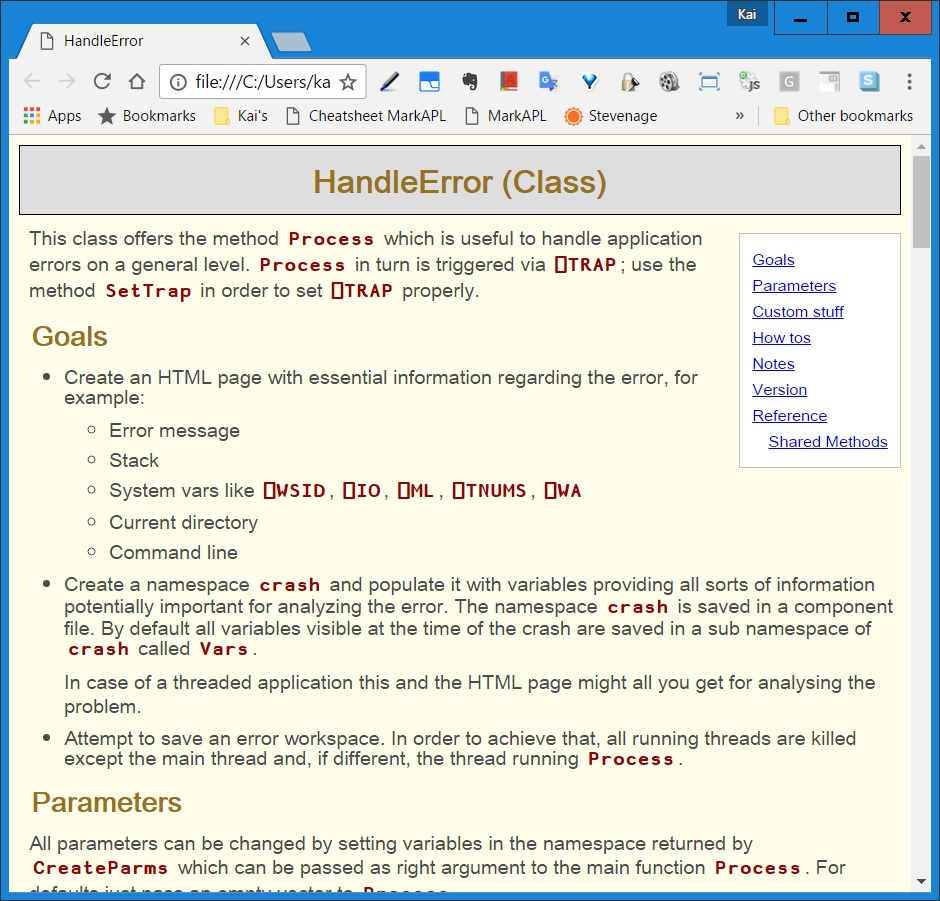
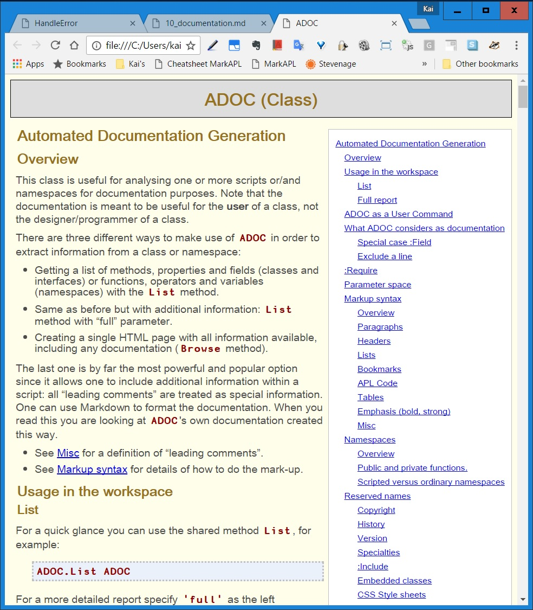
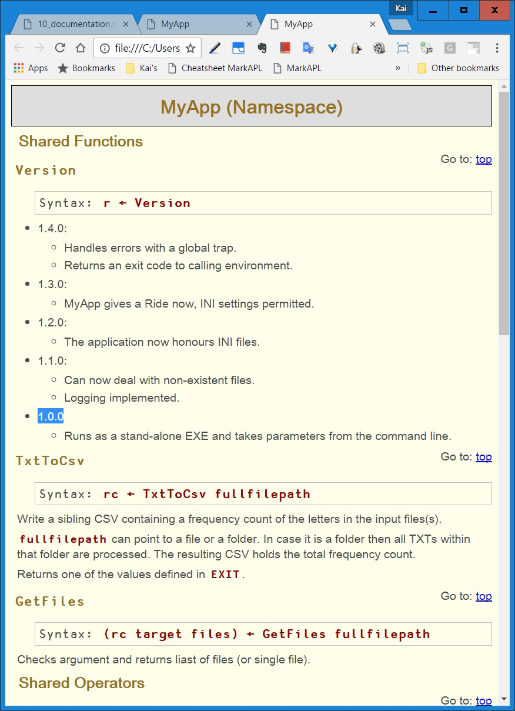
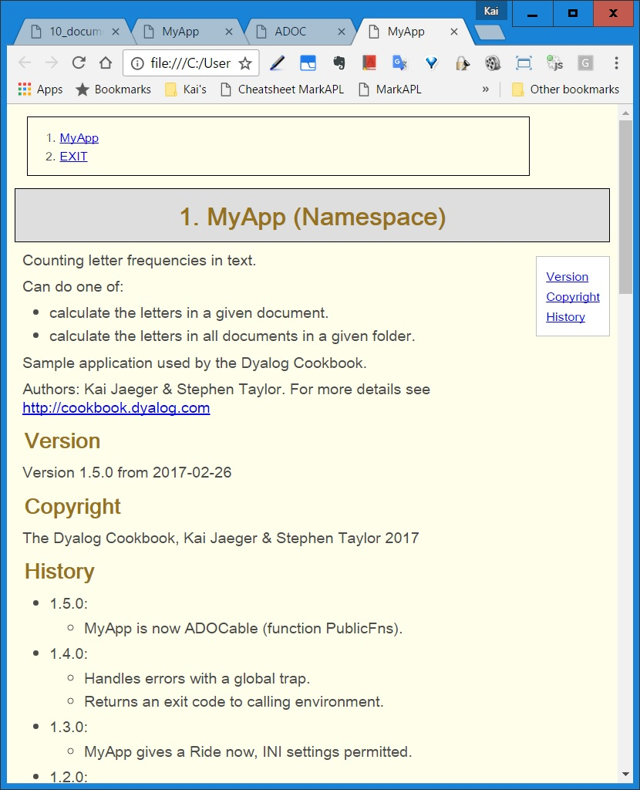
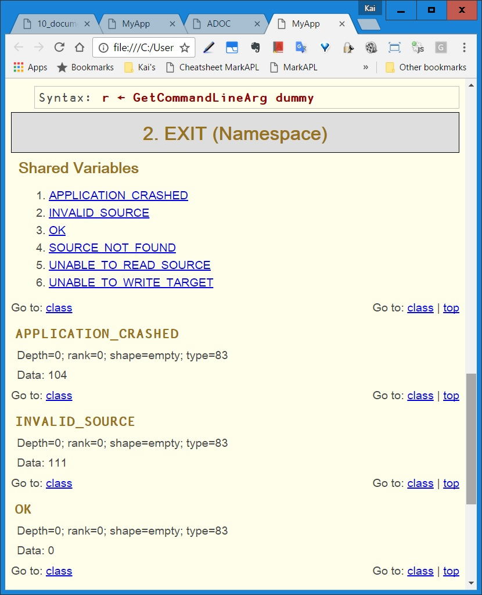

{:: encoding="utf-8" /}

# Documentation -- the Doc is in

Documentation is the bad mother of software. Programmers learn early that we depend on it but must not trust it. On the one hand we need it for the software we use. On the other we learn a great wariness of it for the software we develop. Understanding why this is so will help us see what to do about documenting `MyApp`.

It helps to distinguish three quite different things people refer to as _documentation_.

* instructions on how to use the application
* a description of what the application does
* a description of how the application works

## Instructions on how to use the application

Unless you are writing a tool or components for other developers to use, all software is operated through a graphical user interface. Users know the common conventions of UIs in various contexts. The standard for UIs is relatively demanding. If you know what the application is for, it should be obvious how to use its basic features. The application might help you with wizards (dialogue sequences) to accomplish complex tasks. A user might supplement this by consulting what the Help menu offers. She might search the Web for advice. The last thing she is likely to do is go looking for a printed manual.

We'll come in a later chapter to how to offer online help from a Help menu. For now, we mention Help to exclude it from what we mean by _documentation_.

## A description of what the application does

This is a useful thing to have, perhaps as a sales document. One or two pages suffices. Including limitations is important: files in certain formats, up to certain sizes. Perhaps a list of Frequently Asked Questions [^faq] and their answers.

Beyond that, you have the formal tests. This is what you _know_ the system does. It passes its tests. Especially if you're supporting your application on multiple versions of Windows, you'll want those tests to be extensive.

## A description of how the application works

This is what you want when you revisit part of the code after six months -- or six days in some cases. How does this section work? What's going on here?

In the best case the code explains everything. Software is a story told in two worlds. One world is the domain of the user, for example, a world of customer records. The other world is the arrays and namespaces used to represent them.

Good writing achieves a double vision. The transformations described by the code make sense in both worlds. Ken Iverson once coined the term _expository programming_ for this writing. Expository programs reveal their workings to the reader. They also discover errors more easily, making it possible to "stare the bugs out". (David Armstrong liked to say the best writing style for a philosopher lets him see his errors before his colleagues do.)

APL requires little 'ceremonial code' -- e.g. declarations of data type -- and so makes high levels of semantic density achievable. It is perhaps easier to write expository code than in more commonly-used languages. But we have learned great respect for how quickly we can forget what a piece of code does. Then we need documentation in its third sense.

It's in this third sense that we'll discuss _documentation_.

## The poor relation

We write software for people and people press us for results, which rarely include documentation. No one is pressing us for documentation.

Documentation is for those who come after us, quite probably our future selves. Since 80% of the lifetime costs of software are spent on maintenance, documentation is a good investment. If the software is ours, we're more likely to make that investment. But there will be constant pressure to defer writing it.

The common result of this pressure is that application code has either no documentation, or its documentation is not up to date. Out-of-date documentation is worse than having none. If you have no documentation you have no help with the code. You have to read it and run it to understand what it does. But however difficult that is, it is utterly reliable. Out-of-date documentation is worse: it will mislead you and waste your time before sending you back to the code. Even if the relevant part of it is accurate, once you learn to distrust it, its value is mostly gone.

The only place worth writing documentation is in the code itself. Maintaining documentation separately adds the uncertainty of matching versions. Writing the documentation as comments in the code encourages you to keep it in step with changes to the code. We write comments in three ways, serving slightly different purposes.

Header comments

: A block of comments at the top of a function serves as an abstract, describing argument/s and result and the relationship between them. If the function reads external variables, list them. If the function has side effects (ie writes files or sets external variables) list them.

Heading comments

: Heading comment lines serve exactly as headings in a book or document, helping the reader to navigate its structure.

Trailing comments

: Comments at the ends of lines act as margin notes. Do not use them as a running translation of the code. Instead aim to for expository style and code that needs no translation. On lines where you're not satisfied you've achieved expository style, do write an explanatory comment. Better to reserve trailing comments for other notes, such as `⍝FIXME⍝ slow for >1E7 elements` [^fixme]. (Using a tag such as `⍝FIXME⍝` makes it easy to bookmark lines for review.) Aligning trailing comments to begin at the same column makes them easier to scan, and is considered OCD compliant [^ocd]. 

The above conventions are simple enough and have long been in wide use.

I> Note that Dyalog offers a special command for Aligning Comments: "AC". You can assign a keystroke to this command: open the "Configuration" dialog (Options / Configure...), select the "Keyboard Shortcuts" tab and sort the table with a click on the "Code" column, then look for "AC".

If you are exporting scripts for others to use -- for example, contributing to a library -- then it's worth going a step further. You and other _authors_ of a script need to read comments in the context of the code, but potential _users_ of a script will want to know only how to call its methods.

_Automatic documentation generation_ will extract documentation from your scripts for other users. Just as above, the documentation is maintained as comments in the code. But now header comments are presented without the code lines.

## ADOC

ADOC is an acronym for _automatic documentation_ generation. It works on classes and namespaces.

In its most basic function, it lists methods, properties and fields (functions, operators and variableas) and requires no comments in the code. In its more powerful function, it composes from header comments an HTML page. Honouring Markdown   conventions, it provides all the typographical conventions you need for documentation. If you don't know what Markdown is please read the Markdown article on Wikipedia [^markdown] and `Markdown2Help`'s own help file. The time will be a good investment in any case because these days Markdown is used pretty much everywhere.

Previously only found as a class in the APLTree library, it is now shipped in Dyalog Version 16.0 as three user commands.

### The "List" method

Lists the methods and fields of a class. (Requires no comments.)

~~~
          ]adoc_list #.HandleError
    *** HandleError (Class) ***

    Shared Methods:
      CreateParms
      Process
      ReportErrorToWindowsLog
      SetTrap
      Version
~~~      

### The "Browse" method

~~~
    ]adoc_browse #.HandleError
~~~

Composes in HTML a documentation page and displays it in your default browser. 

### The "Help" method

~~~
    ]adoc_help
~~~    

Browses the ADOC class itself, displaying all the instructions you need to use it. 

## ADOC for MyApp

How might ADOC help us? Start by seeing what ADOC has to say about `MyApp` as it is now:

~~~
    ]adoc_browse #.MyApp
~~~    

We see that ADOC has found and displayed all the functions within the `MyApp` namespace. If `MyApp` would contain any operators and/or variables you would find them in the document as well.

We can improve this in a number of ways. Time for a new version of MyApp. Make a copy of `Z:\code\v09` as `Z:\code\v10`.

### Leading comments: basic information

First we edit the top of the script to follow ADOC's conventions:

~~~
:Namespace MyApp
    ⍝ Counting letter frequencies in text.\\
    ⍝ Can do one of:
    ⍝ * calculate the letters in a given document.
    ⍝ * calculate the letters in all documents in a given folder.
    ⍝
    ⍝ Sample application used by the Dyalog Cookbook.\\
    ⍝ Authors: Kai Jaeger & Stephen Taylor.
    ⍝ For more details see <http://cookbook.dyalog.com>
...
~~~ 

### Public interface

Next we specify which functions we want to be included in the document: not all but just those that are designed to be called from the outside. In a class those are called "Public interface", and it's easy to see why.

For classes ADOC can work out what's public and what isn't due to the `Public Access` statements. For namespaces there is no such mechanism. We just learned that by default ADOC considers all functions and operators as well as all variables public, but it also offers a mechanism to reduce this list to what's really public. For that ADOC looks for a function `Public`. It may return an empty vector (nothing is public at all) or a list of names. This list would define what is public.

Let's define the public functions at the bottom of the script:

~~~
...
∇ r←Public
  r←'StartFromCmdLine' 'TxtToCsv' 'SetLX' 'GetCommandLineArg'
∇
:EndNamespace
~~~

### Reserved names

ADOC honors several functions in a special way. If any such function exists, its result is treated in a special way. In the rare circumstances that you have a name conflict and **don't** want ADOC to treat some of those names in any special way then you have to instruct ADOC accordingly with a parameter spaces. Refer to the ADOC documentation for details regarding `ignoreVersion`, `ignoreCopyright` and `ignoreHistory`.

#### Version

If `Version` is niladic and returns a three-item vector then this vector is expected to be:

* Name 
* Version number
* Version data

These pieces of information are then integrated into the document.

#### Copyright

If `Copyright` is niladic and returns either a simple text vector or a vector of text vectors then these pieces of information are then integrated accordingly into the document.

#### History

If `History` is niladic and should not return a result. Instead it should carry comments with information about the history of the script.

We had already a function `Version` in place, and so far we've added comments regarding the different versions to it. Those should go into `History` instead. Therefore we reaplace the existing `Version` function by these three functions:

~~~
∇ Z←Copyright
  Z←'The Dyalog Cookbook, Kai Jaeger & Stephen Taylor 2017'
∇

∇ r←Version
  r←(⍕⎕THIS)'1.5.0' '2017-02-26'
∇

∇ History      
  ⍝ * 1.5.0:
  ⍝   * MyApp is now ADOCable (function PublicFns).
  ⍝ * 1.4.0:
  ⍝   * Handles errors with a global trap.
  ⍝   * Returns an exit code to calling environment.
  ⍝ * 1.3.0:
  ⍝   * MyApp gives a Ride now, INI settings permitted.
  ⍝ * 1.2.0:
  ⍝   * The application now honours INI files.
  ⍝ * 1.1.0:
  ⍝   * Can now deal with non-existent files.
  ⍝   * Logging implemented.
  ⍝ * 1.0.0
  ⍝   * Runs as a stand-alone EXE and takes parameters from the command line.
∇
~~~

This gives us more prominent copyright and version notices as well as information about the most recent changes.

Finally we need to address the problem that the variables inside `EXIT` are essential for using `MyApp`; they should be part of the documentation. ADOC has ignored the namespace EXIT but we can change this by specifying it explicitly:

~~~
    ]ADOC_Browse #.MyApp,#.MyApp.EXIT
~~~

When you scroll down (or click at "Exit" in the top-left corner) then you get to the part of the document where `EXIT` is documented:

#### ADOC_Doc

There is one more reserved name: `ADOC_Doc`. This is useful when you want to document an unscripted (ordinary) namespace. Just add a niladic function that returns no or a shy result with comments. Those comments are processed in exactly the same way leading comments in scripts are processed.

That will do for now.

[^faq]: Compile those from questions actually asked by users. It's a common mistake to make the list up as "Question we would like our users to ask".

[^ocd]: Thanks to Roger Hui for this term.

[^fixme]: Be it `⍝FIXME⍝` or `⍝CHECKME⍝` or `⍝TODO⍝` - what matters is that you keep it consistent and searchable. That implies that the search term cannot be mistaken as something else by accident. For that reason  `⍝TODO⍝` is slighty better better than `TODO`.

[^markdown]: <https://en.wikipedia.org/wiki/Markdown>
