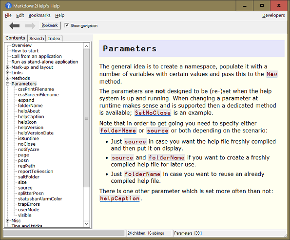

{:: encoding="utf-8" /}

# Providing help

Users expect applications to provide help in one way or another. One option is to provide the help as a hyper text system. Under Windows, CHM files are the standard way to provide such help. There are powerful applications available that can assist you in providing help; HelpAndManual [^ham] is just an example.

However, we take a different approach here: rather than using any third-party software we use `Markdown2Help` from the APLTree library. That allows us to create a help system that...

* offers pretty much the same functionality as CHM.
* allows us to keep the help close to the code.

This is the simplest way to create a help system, and it allows you to run the help system from within your application in order to view either its start page or a particular page as well as viewing the help system without running your application at all.

While CHM files are Windows specific, `Markdown2Help` allows you to export a help system as a web page that can be displayed with any modern browser. That makes it OS-independent. We'll discuss later how to do this.

## Getting ready

It's time to save a copy of `Z:\code\v10` as `Z:\code\v11`. 

In order to use `Markdown2Help` you need to download it from <http://download.aplwiki.com/>. We suggest creating a folder `Markdown2Help` within the folder `Z:\code\APLTree`. Copy the contents of the zip file you've just downloaded into `Z:\code\APLTree\Markdown2Help`:

Within that folder you will find a workspace `Markdown2Help` (from which we are going to copy the module) and a folder "help". This folder contains in turn a sub folder "files" (which contains `Markdown2Help`'s own help system) and the file `ViewHelp.exe`; that is the external viewer you need in case you want to view your help system independently from your application.

Double-click `ViewHelp.exe` in order to see `Markdown2Help2`'s own help system:

By default `ViewHelp.exe` expects to find a folder `files` as a sibling of itself, and it assumes that this folder contains a help system. 

A> ### Specify help folder and help page
A>
A> You can change the folder `ViewHelper.exe` expects to host the help system by specifying a command line parameter "helpFolder":
A>
A> ~~~
A> ViewHelp.exe -helpfolder=C:\Foo\Help
A> ~~~
A>
A> You can also tell `ViewHelper.exe` to put a particular help page on display rather than the default page:
A>
A> ~~~
A> ViewHelp.exe -page=Sub.Foo
A> ~~~
A>
A> However, all these details are discussed in Markdown2Help's own help system.

`Markdown2Help` is an ordinary (non-scripted) namespace. We therefore need to copy it from its workspace. We also need the script `MarkAPL` which is used to convert the help pages (which are written in Markdown) to HTML. You know by now how to download scripts from the APLTree library. Modify `MyApp.dyapp` so that it loads the module `MarkAPL` and also copies `Markdown2Help`:

~~~
...
Load ..\AplTree\Execute
leanpub-start-insert
Load ..\AplTree\MarkAPL
Run 'Markdown2Help' #.⎕CY '..\apltree\Markdown2Help\Markdown2Help.dws'  
leanpub-end-insert
Load Tests
...
~~~

Double-click the DYAPP to get started.

## Creating a new help system

`Markdown2Help` comes with a function `CreateStub` that will create a new help system for us. All we need to do is finding a good name which is not in use. The obvious candidate is "MyHelp". We also want the help system to be managed by SALT, and for that we need to define a folder where all the help files are going to be saved. For that we call `CreateParms` and then specify that folder by setting the parameter `saltFolder`:

~~~
parms←#.Markdown2Help.CreateParms ⍬
parms.saltFolder←'Z:\code\v11\MyHelp'
parms #.Markdown2Help.CreateStub '#.MyHelp'
~~~

Note that in our case the name of the folder and the help system are the same. That is not a requirement but certainly not a bad idea either.

Notes:

* The right argument must be a valid and unused APL name. `CreateStub` will create a namespace with that name for us.
* If a simple (not fully qualified) name is specified that namespace will be created in the namespace the function `CreateStub` was called from. Instead you can also specify a fully qualified name like `#.Foo.Goo.Help`. Note that `Foo` and `Goo` must both exist but `Help` must not.
* `CreateStub` will check the callback associated with the `Fix` event. If that happens to be a SALT function `CreateStub` will check the `saltFolder` parameter. If that's not empty the help system will use SALT for saving the nodes (namespaces), help pages (variables) and function that resemble a help system.  
* `CreateStub` will return a ref pointing to the help system but normally you don't need to assign that.

`CreateStub` will create some pages and a node (or folder) for us.

## Behind the scenes

In the workspace all nodes (in our case "MyHelp" and "Sub") are ordinary namespaces while the pages are variables. You can check with the Workspace Explorer:

This is the reason why the names of nodes and pages must be valid APL names. By default those names are shown in the help system as title in the tree, but if that is not good enough for you then there is of course a way to specify something different. We'll come back to this soon.

## Editing a page

When you right-click on a page like "Copyright" and then select "Edit help page" from the context menu (pressing <Ctrl+Enter> will do the same) the APL editor opens and shows something similar to this:

This is the definition of the help page in Markdown. 

Notes:

* The first line specifies a key-value-pair (`[DATA]`). "index" is the key and "Copyright" is the value of that key.
  This is interpreted by `Markdown2Help` as an index entry.

  Note that this is not a Markdown feature but a `Markdown2Help` feature.
* `# Copyright` defines a header of level one. Every help page must have such a header.
* `(c) Copyright 2017 xyz` is a simple paragraph.

Make some changes, for example add another paragraph `Go to →[Overview]`, and then press <escape>. `Markdown2Help` takes your changes, converts the Markdown to HTML and shows the changed page straight away. This gives you an idea of how easy it actually is to change help pages. Adding, renaming and deleting help pages -- and nodes -- can be achieved via the context menu.

Note also that `→[Overview]` is a link. "Overview" must be the name of a page. If the title of the page is different from the name, the title is going to be shown as link text in the help page.

Even if you are familiar with Markdown you should read `Markdown2Help`'s own help file before you start using Markdown2Help seriously. Some Markdown features are not supported by the help system, and internal links are implemented in a simplified way.

## Changing title and sequence

Note that the "Copyright" page comes first. That's because by default the pages are ordered alphabetically. You can change this with a right-click on either the "Copyright" or the " Overview" page and then select "Manage ∆TopicProperties". After confirming that this is really what you want to do you will see something like this:

~~~
 ∆TopicProperties←{
⍝ This function is needed by the Markdown2Help system.
⍝ You can edit this function from the Markdown2Help GUI via the context menu.
⍝ *** NOTE:
⍝     Make only changes to this function that affect the explicit result.
⍝     Any other changes will eventually disappear because these functions are rebuild
⍝     under program control from their explicit result under certain circumstances.
⍝        This is also the reason why you should use the `active` flag to hide a topic
⍝     temporarily because although just putting a `⍝` symbol in front of its line
⍝     seems to have the same effect, in the long run that's not true because the
⍝     commented line will disappear in the event of a rebuild.
⍝ ----------------------------------
⍝ r gets a table with these columns:
⍝ [;0] namespace or function name.
⍝ [;1] caption in the tree view. If empty the namespace/fns name is taken.
⍝ [;2] active flag.
⍝ [;3] developmentOnly flag; 1=the corresponding node does not show in user mode.
     r←0 4⍴''
     r⍪←'Copyright' '' 1 0
     r⍪←'Overview' '' 1 0
     r⍪←'Sub' '' 1 0
     r
}
~~~

It's well worth reading the comments in this function.

You can specify a different sequence of the pages by simply changing the sequence in which the pages are added to `r`. Here we swap the position of "Copyright" and "Overview":

~~~
 ∆TopicProperties←{
     ...
     r←0 4⍴''
leanpub-start-insert     
     r⍪←'Overview' 'Miller''s overview' 1 0
     r⍪←'Copyright' '' 1 0
leanpub-end-insert     
     r⍪←'Sub' '' 1 0
     r
 }
 ~~~
 
We have also changed the title of the "Overview" page to "Miller's overview". That's how you can specify a specific title to be shown instead of the name of the page.

After fixing the function the help system is re-compiled automatically; therefore our changes become visible immediately:

## More commands

The context menu offers plenty of commands. Note that the first three commands are always available. The other commands are useful for a developer (or shall we say help system author?) and are available only when the help system is running in a development version of Dyalog.

As a developer you should have no problem to master these commands.

## Manipulating the help system directly

What we actually mean by that is for example editing a variable with a double-click in the Workspace Explorer but also editing it with `)ED` from the session. Our advice: **don't!**

The reason is simple: when you change a help system via the context menu then all necessary steps are carried out for you. An example is when you have a `∆TopicProperties` function in a perticular node and you want to add a new help page to that node. You have to right-click on a page and select the "Inject new help page (stub)" command from the context menu. You will then be prompted for a valid name and finally the new help page is injected after the page you have clicked at. But there is more to it than just that: the page is also added for you to the `∆TopicProperties` function. That's one reason why you are advised to perform all changes via the context menu rather than manipulating the help system directly.

Markdown2Help also executes the necessary steps in order to keep the files and folders in `saltFolder` in sync with the help system.

The only exception is when you change your mind about the structure of a help system. If that involves moving around namespaces or plenty of pages between namespaces then it is indeed better to do it in the Workspace Explorer and, when you are done, to check all the `∆TopicProperties` functions within your help system and finally recompile the help system; unless somebody implements drag-and-drop for the TreeView of the help system one day...

However, in that case you must make sure that the help system is saved properly. That means that you have to invoke the `SaveHelpSystemWithSalt` method.

  
## The "Developers" menu

In case the help system is running under a development version of Dyalog you have a "Developers" menu on the right side of the menubar. This offers a couple of commands that support you in keeping your help system healthy. We discuss just the most important ones:

### Show topic in browser

This is particularly useful when you use non-default CSS and there is a problem with it: all modern browsers offer excellent tools for investigating CSS, supporting you when hunting bugs or trying to understand unexpected behaviour.

### "Create proofread document"

This command creates an HTML document from all the help pages and writes the HTML to a temporary file. The filename is printed to the session.

You can then open that document with your favourite word processor, say Microsoft Word. This will show something like this:

This is a great help when it comes to proofreading a document: one can use the "Review" features of the chosen word processor and also print the document. You are much more likely to spot any problems in a printed version of the document than on screen.

### "Reports"

There are several reports available reporting broken and ambiguous links, `∆TopicProperties` functions and help pages that do not carry any index entries.

## Export to HTML

You can export the help system so that it becomes a website. For that select "Export as HTML..." from the "File" menu.

The resulting website does not offer all the features the Windows version comes with but at least you can read and print all the pages, you have the tree structure representing the contents and all the links work. That must do under Linux and Mac OS for the time being.

## Making adjustments

If you have not copied the contents of `code\v11\*` from the book'w website then you should make adjustments to the help system to keep it in sync with the book. We have just two help pages; a page regarding the main method `TxtToCsv`:

And a page regarding copyright:

## How to view the  help system

We want to make sure that we can call the help system from within our application. For that we need a new function, and the obvious name for this function is `ShowHelp`. The function accepts a right argument which might be an empty vector but can be a page name instead. If a page name is provided then of course `Markdown2Help` does not show the first page of the help system but the page specified. The function goes into the `MyApp.dyalog` script:

~~~
:Namespace MyApp
...
∇

leanpub-start-insert 
∇{r}←ShowHelp pagename;ps
  ps←#.Markdown2Help.CreateParms ⍬
  ps.source←#.MyHelp     
  ps.foldername←'Help'
  ps.helpAbout←'MyApp''s help system by John Doe'
  ps.helpCaption←'MyApp Help'
  ps.helpIcon←'file://',##.FilesAndDirs.PWD,'\images\logo.ico'
  ps.helpVersion←'1.0.0'
  ps.helpVersionDate←'YYYY-MM-DD'
  ps.page←pagename
  ps.regPath←'HKCU\Software\MyApp'
  ps.noClose←1
  MyHelpInstance←#.Markdown2Help.New ps
∇
leanpub-end-insert       

∇ r←Public
leanpub-start-insert
  r←'StartFromCmdLine' 'TxtToCsv' 'SetLX' 'GetCommandLineArg' 'ShowHelp'
leanpub-end-insert  
∇

:EndNamespace
~~~

I> In case you wonder why a Window Registry key is specified: the user can mark any help page as a favourite, and this is saved in the Windows Registry. We will discuss the Windows Registry in a later chapter.

This function requires the help system to be available in the workspace. Soon we will modify the DYAPPs so that the help system will be loaded when developing and made available when the application is assembled.

Strictly speaking only the "source" parameter needs to be specified to get it to work, but you really want to specify other parameters as well before a client sets eye on your help system.

Most of the parameters should explain themselves, but if you are in doubt you can always start `Markdown2Help`'s own help system with `#.Markdown2Help.Selfie ⍬` and read the pages under the "Parameters" node. That's what you would see:

You also get a list of all parameters with their default values with this statement:

~~~
      ⎕←(#.Markdown2Help.CreateParms'').∆List''
~~~

Note that `CreateParms` is one of the few functions in the APLTree library with that name that actually require a right argument. This right argument may be just an empty vector, but instead it could be a namespace with variables like "source" or "page". In that case `CreateParms` would inject any missing parameters into that namespace and return is as result. 

Therefore we could re-write the function `ShowHelp`:

~~~
∇{r}←ShowHelp pagename;ps
  ps←⎕NS ''
  ps.source←#.MyHelp     
  ps.foldername←'Help'
  ps.helpAbout←'MyApp''s help system by John Doe'
  ps.helpCaption←'MyApp Help'
  ps.helpIcon←'file://',##.FilesAndDirs.PWD,'\images\logo.ico'
  ps.helpVersion←'1.0.0'
  ps.helpVersionDate←'YYYY-MM-DD'
  ps.page←pagename
  ps.regPath←'HKCU\Software\MyApp'
  ps.noClose←1
  ps←#.Markdown2Help.CreateParms ps     
  MyHelpInstance←#.Markdown2Help.New ps
∇
~~~

This version of `ShowHelp` would produce exactly the same result:

## Calling the help system from your application

* Start the help system by calling the `New` function as soon as the user presses F1 or select "Help" from the menubar or requests a particular help page by other means. Catch the result and assign it to a meaningful name: this represents your help system. We use the name `MyHelpInstance`.
* Specify `noClose←1`. This means that when the user attempts to close the help system with a click into the close box or by selecting the "Quit" command from the "File" menu or by pressing Alt+F4 or Ctrl+W then the help system is not really closed down, it just makes itself invisible.
* When the user later requests again a help page use this:

  ~~~
  1 #.Markdown2Help.Display MyHelpInstance 'Misc'
  ~~~
  
  * The `1` provided as left argument forces the GUI to make itself visible, no matter whether it is visible right now or not: the user might have "closed" the help system since she requested a help page.
  * `MyHelpInstance` represents the help system. 
  * "Misc" is the name of the page to be displayed. Can also be empty (`⍬`) in which case the first page is shown.
  
  Note that the overhead of bringing the help system back this way is pretty close to zero. If you _really_ want to get rid of the help system just delete the reference.

## Compiling the help system

What means "compiling", really?

"Compiling the help system" means to convert the pieces of information represented by the structure of the help system plus the variables holding Markdown plus the additional rules defined by any `∆TopicProperties` function into a single component file that contains the HTML generated from the Markdown plus some more information.

It's more than just converting Markdown to HTML. For example, the words of all pages are extracted, words like "and", "then", "it" etc. are removed (because searching for them does not make too much sense) and then the list is, together with the information to which page(s) they belong to, saved in a component. This allows `Markdown2Help` to provide a very fast search function. Actually the list is saved twice, once "as is" and once with all words lowercased: that speeds up any case insensitive search operations.
 
Without specifying a particular folder `Markdown2Help` would create a temporary folder and compile into that folder. It is better to define a permanent location because it means that the help system does not need to compile the Markdown into HTML over and over again whenever it is called. Such a permanent location is also the pre-condition for being able to put the help system on display with the external viewer, something you _must_ do for obvious reasons when your help system is supposed to offer help on how to install your application.

Note that for converting the Markdown to HTML `Markdown2Help` needs the `MarkAPL` class, but once the help system is compiled this class is not needed any more. Therefore the final version of your application would not need `MarkAPL`, and because `MarkAPL` comprises roughly 3,000 lines of code this is good news.

## Adding the help system to "MyApp.dyapp"

Now that we have a help system that is saved in the right place we have to make sure that it is loaded when we assemble a workspace with a DYAPP. In a first step we add a function `LoadHelp` to the `DevHelpers` class:

~~~
:Namespace DevHelpers
...
    
    ∇{r}←LoadHelp dummy;parms
    parms←#.Markdown2Help.CreateParms ⍬
    parms.saltFolder←#.FilesAndDirs.PWD,'\Help\files'
    parms.source←'#.MyHelp'
    {}#.Markdown2Help.LoadHelpWithSalt parms
    ∇

:EndNamespace
~~~

Calling this function will load the help system from `saltFolder` into the namespace `#.MyHelp` in the current workspace. Therefore we need to call this function within `MyApp.dyapp`:

~~~
...
Load DevHelpers
leanpub-start-insert     
Run DevHelpers.LoadHelp ⍬
leanpub-end-insert     
Run #.MyApp.SetLX #.MyApp.GetCommandLineArg ⍬
...
~~~

## Enhancing "Make.dyapp"

Now we need to make sure that the "Make" process incorporates the help system.

[^ham]: <http://www.helpandmanual.com/>