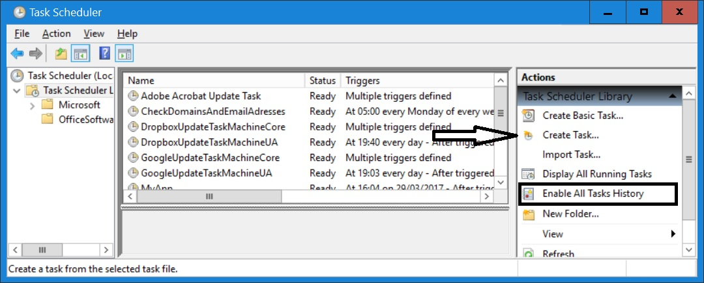
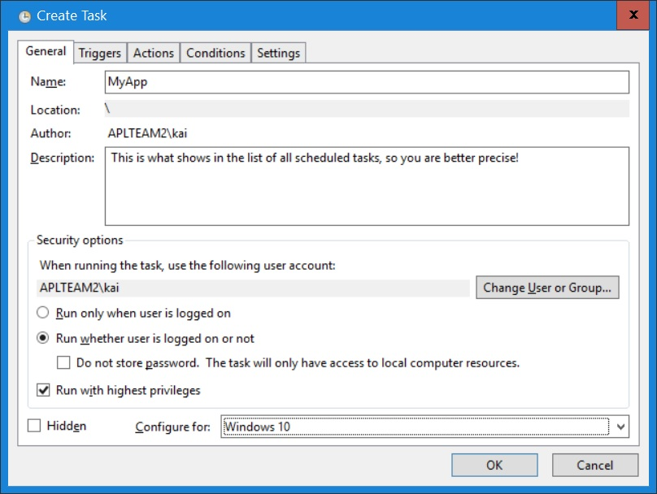
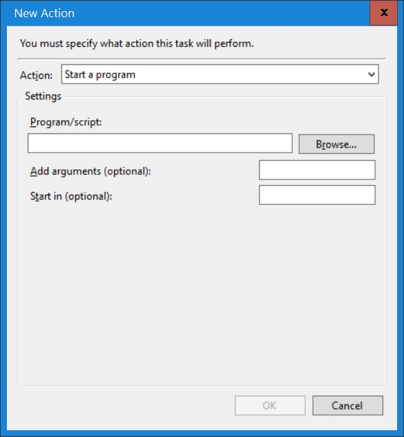

{:: encoding="utf-8" /}

# Scheduled Tasks

## What is a Scheduled Task?

Windows offers a task scheduler in order to run application at specific times. Like Services Scheduled Tasks are designed for background job, meaningthat such application have no GUI.

The Scheduler allows you to start the application on a specific date and time once, or every day, every week or every month. The user does not have to be logged on (that's different from old versions of Windows) and it allows different rights.

## What can and cannot be achieved by Scheduled Tasks

Scheduled Tasks -- like Services -- are perfect for background tasks. Examples are:

* Take a backup once a week
* Check the availability of your website once every hour
* Send a test email to all your email addresses once a day

Scheduled Tasks cannot interact with the user: when you try to put up a GUI and ask a question then nothing will appear on the screen: you just can't do this.

## Scheduled Tasks versus Services

If your application needs to run all the time, even with delays between actions, then running as a Service would be more approriate. Services are typically started automatically when the machine is bootet, and they keep running until the next boot.

To make this point clear, imagine these two scenarios:

* You need an application to start once a week and take a backup of a specific folder.
* You need an application to constantly monitor a specific folder for certain file types (say Markdown) and convert them (say into HTML files).

The former is clearly a candidate for a Scheduled Task while the latter is a candidate for a Service.

## Preconditions for a Scheduled Task

You need either a saved workspace with `⎕LX` set or an EXE created from a workspace. Unless you need to make sure that your code cannot be looked at, an EXE has no advantages over a simple saved workspace; it just adds complexity and therefore should be avoided if there aren't any advantages. However, if you cannot be sure whether Dyalog is installed on the target machine then you have no choice: it has to be a stand-alone EXE.

Note that 

We have already taken care of handling errors and writing to log files, which are the only sources for analyzing any problems that pop up when a Scheduled Task runs, or crashes. In other words, we are ready to go.

Our application does not suggest itself as a Scheduled Task; it's obviously a candidate for running as a Service, but that does not mean it cannot run as a Scheduled Task, so let's start.

## Precautions: ensure one instance only

When dealing with Scheduled Tasks then usually you don't want more than one instance of the application running at the same time. When there is a problem with a Scheduled Task then one of the most common reasons why getting to the bottom of the problem turns out to be difficult is that you fire up another instance when there is already one running. For example, you try to Ride into it but the port used by Ride is already occupied by an instance that was started earlier without you being aware. For that reason we are going to prevent this from happening.

A> Even in the rare circumstances when you want the same application managed by the Task Scheduler to run in parallal more than once you should establish a machanism which allows you to enforce having just one instance running if this is needed for debugging purposes. Make it an INI entry (like "AllowMultipleInstances") and document it appropriately.

We resume, as usual, by saving a copy of `Z:\code\v11` as `Z:\code\v12`.

In order to force the application to run only once at any given time we add a function `CheckForOtherInstances` to `MyApp.dyalog`:

~~~
∇ {tno}←CheckForOtherInstances dummy;filename;listOfTiedFiles;ind
 ⍝ Attempts to tie the file "MyAppCtrl.dcf" exclusively and returns the tie number.
 ⍝ If that is not possible than an error is thrown because we can assume that the
 ⍝ application is already running.\\
 ⍝ Notes:
 ⍝ * In case the file is already tied it is untied first.
 ⍝ * If the file does not exist it is created.
   filename←'MyAppCtrl.dcf'
   :If 0=F.IsFile filename
       tno←filename ⎕FCREATE 0
   :Else
       :If ~0∊⍴⎕FNUMS
           listOfTiedFiles←A.dtb↓⎕FNAMES
           ind←listOfTiedFiles⍳⊂filename
       :AndIf ind≤⍴⎕FNUMS
           ⎕FUNTIE ind⊃⎕FNUMS
       :EndIf
       :Trap 24
           tno←filename ⎕FTIE 0
       :Else
           'Application is already running'⎕SIGNAL EXIT.ALREADY_RUNNING
       :EndTrap
   :EndIf
∇
~~~

Notes:

* First we check whether the file `MyAppCtrl.dcf` exists. If it doesn't we create it and the job is done: creating a file always implies an exclusive tie.
* If it does exist we check whether it is tied by itself, in case we are developing and have restarted the application without having closed it down properly. We then untie the file.
* Finally we attempt to tie the file exclusively but trap error 24 - that's "FILE TIED". If that's the case we throw an error `EXIT.ALREADY_RUNNING`.
* The file is expected (or will be created) in the current directory. 

Since this function will throw an error `ALREADY_RUNNING` we need to add this to the `EXIT` namespace in `MyApp`:

~~~
:Namespace EXIT
...
        UNABLE_TO_WRITE_TARGET←114
leanpub-start-insert           
        ALREADY_RUNNING←115
leanpub-end-insert           
          GetName←{
        ....
:EndNamespace        
~~~

We change `Initial` so that it calls this new function:

~~~
∇ (Config MyLogger)←Initial dummy
...
   Config←CreateConfig ⍬
leanpub-start-insert   
   Config.ControlFileTieNo←CheckForOtherInstances
leanpub-end-insert   
   CheckForRide Config
...
∇
~~~

We want to untie the file as well. So far we have not payed any attention to how to close the application down properly, therefore we take the opportunity to introduce a function `Cleanup` which is doing that:

~~~
∇ {r}←Cleanup
   r←⍬   
   ⎕FUNTIE Config.ControlFileTieNo
   Config.ControlFileTieNo←⍬   
∇

:EndNamespace
~~~

Of course we have to call `Cleanup` from somewhere:

~~~
∇ {r}←StartFromCmdLine arg;MyLogger;Config;rc;⎕TRAP
 ...
   rc←TxtToCsv arg~''''
leanpub-start-insert      
   Cleanup
leanpub-end-insert      
   Off rc
∇
~~~

After all these changes it's time to execute our test cases. Execute `#.Tests.Run`.

Turns out that two of them fail! The reason is simple: when we run `Test_exe_01` and `Test_exe_02` the control file is already tied. That's because `Test_TxtToCsv` runs first, and it calls `Initial` -- which ties the control file -- but not `Cleanup` which would untie it. The fix is simple: we need to call `Cleanup` in the test. However, we can't just do this at the end of `Test_TxtToCsv_01`:

~~~
∇ R←Test_TxtToCsv_01(stopFlag batchFlag);⎕TRAP;rc
...
   →FailsIf rc≢##.MyApp.EXIT.SOURCE_NOT_FOUND
   #.MyApp.Cleanup ⍬
   R←∆OK
∇
~~~

If we do this then `Cleanup` would not be called in case the check fails. Let's do it properly instead:

~~~
∇ R←Test_TxtToCsv_01(stopFlag batchFlag);⎕TRAP;rc
...
   →GoToTidyUp rc≢##.MyApp.EXIT.SOURCE_NOT_FOUND                        
   R←∆OK                                                                
  ∆TidyUp:                                                              
   ##.MyApp.Cleanup ⍬                                                   
~~~

I> Note that we must call `MyApp.Cleanup` rather than just `Cleanup` because we are at that moment in `Tests`, and we don't want to execute `Tests.Cleanup`!

We can learn some lessons from this:

1. Obviously the sequence in which the test cases are executed can have an impact on whether tests fail or not. If `Test_TxtToCsv` would have been the last test case the problem would have slipped through undetected.

1. That a test suite runs through OK does not necessarily mean it will keep doing so when you execute it again.

## Create a Scheduled Task

### Start the Scheduler

Press the <Win> key and type Scheduler. Select "Task Scheduler" form the list. This is what will come up:

First thing to check is that the contents of the black rectangle in the "Actions" pane on the right reads "Enable All Tasks History" - if it does not you won't be able to get to the bottom of any problems.

The arrow points to the "Create Task" command - click it.

#### The "General" tab

Name 
: Used in the list presented by the Task Scheduler.

Description
: Shown in the list presented by the Task Scheduler. Keep it concise.

Run only when user is logged on
: You will almost certainly change this to "Run whether user is logged on or not".

Do not store password
: The password is stored savely, so there is not really a reason not to provide it.

Running with highest privileges
: Unfortunately this check box is offered no matter whether your user account has admin rights or not. If it does not, then ticking the box won't make a difference at all.

: If your user account has no admin rights but your Scheduled Task needs to run with hightest privileges then you need to specify a different user id / password after clicking the "Change user or group" button.

: Whether your application needs to run with hightest privileges or not is impossible to say. Experience shows that sometimes something that does not work when -- and only when -- the application is running as a Scheduled Task will work fine with highest privileges although it is by no means clear what those rights are required for.

Configure for

: Generaly you should select the OS the task is running on.

A> ### UAC, admin rights and all the rest
A> 
A> With the UAC, users of the admin group have 2 tokens. The filtered token represents standard user rights. This token is used by default, for example when you create a shell (console). Therefore you have just standard user rights by default even when using a user account with admin rights. However, when you have admin rights and you click an EXE and select "run as administor", the full token is used which contains admin rights.
A> 
A> Notes:
A> * Some applications ask for admin rights even when you do not right-click on the EXE and select "Run as administrator"; the Registry Editor and the Task Explorer are examples.
A> * Even if you run an application with admin rights (sometimes called "in elevated mode") it does not mean that the application can do whatever it likes, but as an admin you can always give yourself any missing rights.

#### The "Trigger" tab

The tab does not carry any mysteries.

#### The tab "Action"

After clicking "New" this is what you get:

Make sure that you use the "Browse" button to navigate to the EXE/BAT/whatever you want to run as a Scheduled Task. That avoids typos.

"Add arguments" allows you specify something like "maxws=345MB" or the name of a workspace in case "Program" is not an EXE but a Dyalog interpreter.

"Start in" is useful for specifying what will become the current (or working) directory for the running program. We recommend to set the current directory within your woekspace, so you don't need to set this here, but in order to be able to specify a workspace name with a path you have to. If you want to do this be aware of a trap: _never_ add quotes to a path plugged into "Start in"!

#### The "Conditions" tab

The tab does not carry any mysteries.

#### The "Settings" tab

Unless you have a very good reason not to you should "Allow task to be run on demand" which means you have the "Run" command available on the context menu.

Note that you may specify restart parameters in case the task fails. Whether that makes any sense at all depends very much on the application.

The combo box at the bottom allows you to select "Stop the existing instance" which can be quite useful while debugging the application.

### Running a Schduled Task

To start the task right-click on it in the Task Scheduler and select "Run" from the context menu. Then check the log file folder. Ideally you should see a log file that contains something like this:

~~~
2017-03-31 10:03:35 *** Log File opened
2017-03-31 10:03:35 (0) Started MyApp in ...\code\v12\MyApp
2017-03-31 10:03:35 (0)  ...\code\v12\MyApp\MyApp.exe maxws=370MB
2017-03-31 10:03:35 (0)  Accents            ÁÂÃÀÄÅÇÐÈÊËÉÌÍÎÏÑÒÓÔÕÖØÙÚÛÜÝ  AAAAAACDEEEEIIIINOOOOOOUUUUY  
2017-03-31 10:03:35 (0)  ControlFileTieNo                                                             1 
2017-03-31 10:03:35 (0)  Debug                                                                        0 
2017-03-31 10:03:35 (0)  DumpFolder                             C:\Users\kai\AppData\Local\MyApp\Errors 
2017-03-31 10:03:35 (0)  ForceError                                                                   0 
2017-03-31 10:03:35 (0)  LogFolder                                 C:\Users\kai\AppData\Local\MyApp\Log 
2017-03-31 10:03:35 (0)  Ride                                                                         0 
2017-03-31 10:03:35 (0)  Trap                                                                         1 
2017-03-31 10:03:35 (0) Source: maxws=370MB
2017-03-31 10:03:35 (0) *** ERROR RC=112; MyApp is unexpectedly shutting down: SOURCE_NOT_FOUND
~~~

Since we have not provided a filename `MyApp` assumed that "maxws=370MB" would be the filename. Since that does not exist the application quits with a return code SOURCE_NOT_FOUND, which is exactly what we expected.

## Tips, tricks, pitfalls.

### The Task Scheduler GUI

Once you have executed the "Run" command from the context menu the GUI changes the status from "Ready" to "Running". That's fine. Unfortunately it won't change automatically back to "Ready" once the job has finished, at least not at the time of writing (2017-03) under Windows 10. For that you have to press F5.

### Re-make "MyApp"

In case you've found a bug and execute `MyApp`'s make again keep in mind that this means the INI file will be overwritten. So in case you've changed, say, Ride's `Active` flag in the INI file from being 0 to 1, it will be 0 again after the make, so any attempt to Ride into the EXE will fail. That's something easy to forget.

### MyApp crashes with rc=32

You most probably tried to Ride into the EXE but forgot to copy over the DLLs needed by Ride [^ride] itself. That's what trigger the return code 32 which stands for "File not find".

A> ### Windows return codes
A> 
A> In case you want to translate a Windows return code like 32 into a more meaningful piece of information you can do this:
A> 
A> ~~~
A>       ]load ..\apltree\WinSys
A> #.WinSys
A>       #.WinSys.GetMsgFrom 32
A> The process cannot access the file because it is being used by another process.
A> ~~~
A>
A> However, Microsoft being Microsoft, the error messages are not always that helpful. The above message is issued in case you try to switch on Ride in an application and the interpreter cannot find the DLLs needed by Ride.

### Binding MyAPP with the Dyalog development EXE

If for some reason you've created `MyApp.exe` by binding the application with the development version of Dyalog rather than the RunTime (you can do this by providing a 0 as left argument to the `MakeExport` function) then you might run into a problem: Our code take into account whether it is running under a development EXE or a runtime EXE: error trapping will be inactive (unless it it enforced via the INI file) and no `⎕OFF` will be executed either. Therefore you are advised not to do this: because you have Ride at your disposal it has no advantages over the runtime EXE anyway

### Task Scheduler error codes

In case the Task Scheduler itself throwsa an error you will find them of little value at first sight. You can provoke such an error quite easily: edit the task we've created and change the contents of the "Program/script" field in the "Edit action" dialog to something that does not exist, meaning that the Task Scheduler won't find such a program. Then issue the "Run" command from the context menu.

Update the GUI by pressing F5 and you will see that errors are reported. The row that reads "Task Start Failed" in the "Task Category" columns and "Launch Failure" in the "Operational Code" columns is the one we are interested in. When you click at this row you will find that it reports an "Error Value 2147942402". What exactly does this mean?

One way to find out is to google for 2147942402. For this particular error this will certainly do, but sometimes you will have to go through plenty of pages when people managed to produce the same error code in very different circumstances, and that can be quite time consuming.

Instead we use this function written by Phil Last [^last]:

~~~
ToHex←{
     t←0∊⊃⍬⍴0⍴⊂⍵
     a←⎕D,'abcdef',⎕D,6⍴⎕A
     t:a⌷⍨⊂⍉16⊥⍣¯1⊢⍵
     16⊥⍉16|a⍳⍵
⍝ ⍵ dec-number or hex-string
⍝ ← hex-string or dec-number
⍝   accepts hex as CAPS or small
⍝   returns hex as small
⍝   dec to hex is rank increasing
⍝   hex to dec is rank decreasing
 }
~~~

With this function we can convert the decimal value 2147942402 into a hex value:

~~~
      ToHex 2147942402
80070002
~~~

Now the first four digits, 8007, is a win32 status code. The last 2 are the status code. This is hex that needs to be converted into decimal (the `]fromhex` user command would do), but because the number is so small there is not difference between hex and decimal anyway, so we can 

~~~
      ]load ..\apltree\WinSys
#.WinSys
      #.WinSys.GetMsgFrom 2
The system cannot find the file specified.      
~~~

That's the reason why it failed.

### Quotes in the "" field

[^ride]: This topic was discussed in the chapter "Debugging a stand-alone EXE"

[^last]: <http://aplwiki.com/PhilLast>