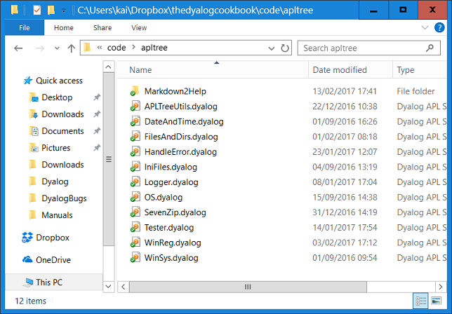
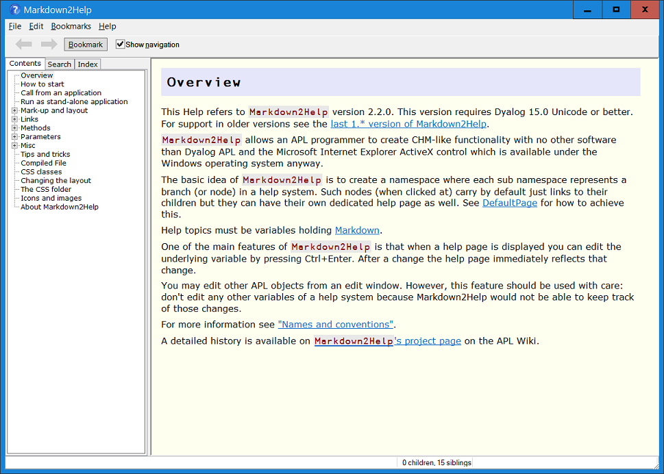
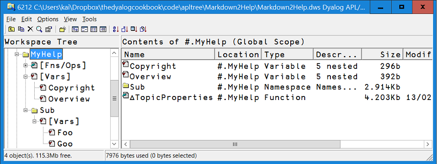
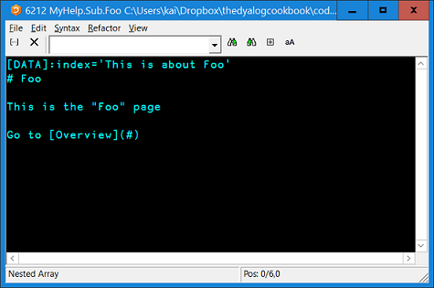
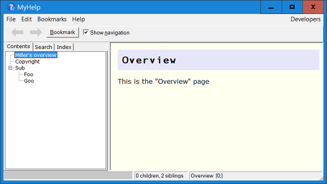
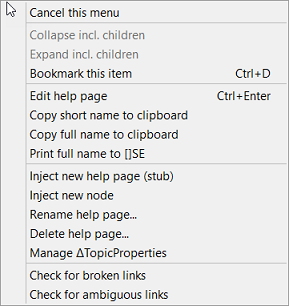
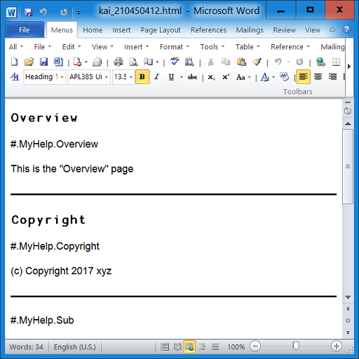

{:: encoding="utf-8" /}

# Providing help

There is little doubt that providing help is a must for pretty much any application. Under Windows, CHM files are the standard way to provide help. There are powerful applications available that can assist you in providing help; HelpAndManual [^ham] is just an example.

However, we take a different approach here: rather than using any third-party software we use `Markdown2Help` from the APLTree library. That allows us to create a help system that...

* offers pretty much the same functionality as CHM.
* allows us to keep the help very close to the code.

This is the simplest way to create a help system, and it allows you to start the help system from within your application (either the start page or a particular page) as well as viewing the help system without running your application.

While CHM files are Windows specific, `Markdown2Help` allows you to export the help system as a web page that can be displayed with any modern browser. Naturally that includes Linux and Mac OS. Though the functionality of such a website is quite limited it still gives a user full access to all the information provided by the help system.

## Getting ready

In order to use `Markdown2Help` you need to download it from <http://download.aplwiki.com/>. We suggest creating a folder "Markdown2Help" within the folder `Z:\code\APLTree`. Copy the contents of the zip file you've just downloaded into `Z:\code\APLTree\Markdown2Help`:

Within that folder you will find a workspace `Markdown2Help` (from which we are going to copy the module) and a folder "help". This sub-folder contains in turn a sub-folder "files" (which contains `Markdown2Help`'s own help system) and the file `ViewHelp.exe`; that is the external viewer you need in case you want to view your help system independently from your application.

By default `ViewHelp.exe` expects to find a folder `files` as a sibling of itself, and it assumes that this folder contains a help system. 

Double-click the EXE and you will see `Markdown2Help2`'s own help system:

We also need the script `MarkAPL` which is used to convert the help pages -- which are written in Markdown [^markdown] -- to HTML. You know by now how to download scripts from the APLTree library.

Finally we need to modify the DYAPP so that our boot function loads the module into the workspace:

~~~
... ⍝TODO⍝
leanpub-start-insert
Load 'MarkAPL'
'Markdown2Help' #.⎕CY 'code\Markdown2Help'  ⍝TODO⍝  Check!
leanpub-end-insert
~~~

Double-click the DYAPP to get started.

## Creating a new help system

`Markdown2Help` comes with a function `CreateStub` that will create a new help system for us. All we need is to find a good name which is not in use. The obvious candidate is "MyHelp", so we execute this statement:

~~~
#.Markdown2Help.CreateStub 'MyHelp'
~~~

Notes:

* The right argument must be a valid and unused APL name. `CreateStub` will create a namespace with that name for us. 
* By default that namespace will be created in the root (`#`) but via the optional left argument you can specify a different parent.
* `CreateStub` will return a ref pointing to the help system but normally you don't need to assign that.

`CreateStub` will create some pages and a node (or folder) for us.

## Behind the scenes

In the workspace all nodes (in our case "MyHelp" and "Sub") are ordinary namespaces while the pages are variables. You can check with the Workspace Explorer:

This is the reason why the names of all nodes and all pages must be valid APL names. By default those names are shown in the help system, but of course there is a way to specify something different that is displayed as the title if that's not good enough for you.

## Editing a page

When you right-click on a page like "Foo" and then select "Edit help page" from the context menu (pressing <Ctrl+Enter> will do the same) the APL editor opens and shows something similar to this:

This is the definition of the help page in Markdown. (If you don't know what Markdown is please read both the Markdown article on Wikipedia [^markdown] and `Markdown2Help`'s own help file. The time will be a good investment in any case because these days Markdown is used pretty much everywhere)

Notes:

* The first line specifies a key-value-pair. "index" is the key and "This is about foo" is the value of that key. This is interpreted by `Markdown2Help` as an index entry.

  Note that this is not a Markdown feature but a `Markdown2Help` feature.
* `# Foo` defines a header of level one. Every help page must have such a header.
* `This is the "Foo" page` is a simple paragraph.
* `Go to [Overview](#)` is also a paragraph, but this paragraph carries a link. While "Overview" is the link text the `#` between the two parentheses defines this as a bookmark link. Since the bookmark link has no name (there is nothing on the right side of the `#` symbol) it is assumed that the link text identifies the page.

  This works because all headers get an anchor assigned by default.

Make some changes, for example add another paragraph, and then press <escape>. `Markdown2Help` takes your changes, converts the Markdown to HTML and shows the changed page straight away. This gives you an idea of how easy it actually is to change help pages. Adding and deleting help pages can be achieved via the context menu.

## Changing title and sequence

Note that the "Copyright" page comes first. That's because by default the pages are ordered alphabetically. You can change this with a right-click on either the "Copyright" or the " Overview" page and then select "Manage ∆TopicProperties". After confirming that this is really what you want to do you will see something like this:

~~~
 ∆TopicProperties←{
⍝ This function is needed by the Markdown2Help system.
⍝ You can edit this function from the Markdown2Help GUI via the context menu.
⍝ *** NOTE:
⍝ Make only changes to this function that affect the explicit result.
⍝ Any other changes will eventually disappear because these fns are rebuild
⍝ under program control from their explicit result occasionally.
⍝   This is also the reason why you should use the `active` flag to hide a 
⍝ topic temporarily because although just putting a `⍝` symbol in front of 
⍝ its line seems to have the same effect, in the long run that's not true 
⍝ because the commented line will disappear in the event of a rebuild.
⍝ ----------------------------------
⍝ r gets a table with these columns:
⍝ [;0] namespace or function name.
⍝ [;1] caption in the tree view. If empty the namespace/fns name is taken.
⍝ [;2] active flag.
⍝ [;3] developmentOnly flag; 1=the corresponding node does not show in user mode.
     r←0 4⍴''
     r⍪←'Overview' '' 1 0
     r⍪←'Copyright' '' 1 0
     r⍪←'Sub' '' 1 0
     r
 }
~~~

It's well worth reading the comments in this function.

You can specify a non-alphabetic sequence of the pages by simply changing the sequence in which the pages are added to `r`:

~~~
 ∆TopicProperties←{
     ...
     r←0 4⍴''
     r⍪←'Overview' 'Miller''s overview' 1 0
     r⍪←'Copyright' '' 1 0
     r⍪←'Sub' '' 1 0
     r
 }
 ~~~
 
We have also changed the title of the "Overview" page to "Miller's overview". Because the name of a page **must** be a valid APL name there needs to be a way in case that's not sufficient for your title.

After fixing the function the help system is re-compiled automatically; therefore our changes become visible immediately:

## More commands

The context menu offers plenty of commands. Note that the first three commands are always available. The other commands are useful for a developer (or shall we say help system author?) and are available only when the help system is running in a development version of Dyalog.

As a developer you should have no problem to master these commands.

## Manipulating the help system directly

What we actually mean by that is for example editing a variable with a double-click in the Workspace Explorer but also editing it with `)ED` from the session. 

Our advice: **don't!**

The reason is simple: when you change a help system via the context menu then any necessary steps are performed for you. An example is when you have a `∆TopicProperties` function in a perticular node and you want to add a new help page to that node. You have to right-click on a page and select the "Inject new help page (stub)" command from the context menu. You will then be prompted for a valid name and finally the new help page is injected after the page you have clicked at. But there is more to it than just that: the page is also added for you to the `∆TopicProprties` function.

That's the reason why you are advised to perform all changes via the context menu rather than manipulating the help system directly.

The only exception is when you change your mind about the structure of a help system. If that involves moving around namespaces or plenty of pages between namespaces then it is indeed better to do it in the Workspace Explorer and, when you are done, to check all the `∆TopicProperties` functions within your help system and finally recompile the help system.

Unless somebody implements drag-and-drop for the TreeView of the help system one day...

## How to view the  help system

We want to make sure that we can call the help system from within our application. For that we need a new function, and the obvious name for this function is `ShowHelp`. The function accepts a right argument which might be an empty vector but can be a page name instead. If a page name is provided that of course `Markdown2Help` does not show the first page of the help system but the page specified.

~~~
   ∇{r}←ShowHelp pagename
     ps←#.Markdown2Help.CreateParms ⍬
     ps.source←#.MyHelp
     
     ps.foldername←  ⍝TODO⍝
     ps.helpAbout←'MyApp''s help system by John Doe
     ps.helpCaption←'MyApp Help'
     ps.helpIcon←'C:\MyIcons\MyApp.ico'
     ps.helpVersion←'1.0.0'
     ps.helpVersionDate←'2017-02-13'
     ps.page←pagename
     ps.regPath←'HKCU\Software\MyCompany\MyApp'
     ps.noClose←1
     MyHelpInstance←#.Markdown2Help.New ps
   ∇
~~~

Strictly speaking only the "source" parameter needs to be specified to get it to work, but you really want to specify other parameters as well before a customer sets eye on your help system.

Most of the parameters should explain themselves, but if you are in doubt you can always start `Markdown2Help`'s own help system with `#.Markdown2Help.Selfy 0` and read the pages under the "Parameters" node. You also get a list of all parameters with their default values with this statement (once the result of `CreateParms` has been assigned to `ps` that is):

~~~
      ⎕←ps.∆List
~~~

Note that `CreateParms` is one of the few functions in the APLTree library with that name that actually require a right argument. This right argument may be just an empty vector, but instead it could be a namespace with variables like "source" or "page". In that case `CreateParms` would inject any missing parameters into that namespace and return is as result. 

Therefore we could re-write the function `ShowHelp`:

~~~
∇{r}←ShowHelp pagename
     ps←⎕NS ''
     ps.source←#.MyHelp     
     ps.foldername←  ⍝TODO⍝
     ps.helpAbout←'MyApp''s help system by John Doe
     ps.helpCaption←'MyApp Help'
     ps.helpIcon←'C:\MyIcons\MyApp.ico'
     ps.helpVersion←'1.0.0'
     ps.helpVersionDate←'2017-02-13'
     ps.page←pagename
     ps.regPath←'HKCU\Software\MyCompany\MyApp'
     ps.noClose←1
     ps←#.Markdown2Help.CreateParms ps     
     MyHelpInstance←#.Markdown2Help.New ps
   ∇
~~~

It would have exactly the same result.

## Compiling the help system

 I>### What means "compiling", really?
 I>
 I> "Compiling the help system" means actually more than just converting Markdown to HTML. For example, the words of all pages are extracted, words like "and", "then", "it" etc. are removed (because searching for them does not make too much sense) and then the list is, together with the information to which page(s) they belong to, saved in a component file. This allows `Markdown2Help` to provide a very fast search function. Actually the list is saved twice, once "as is" and once with all words lowercased: that speeds up any case insensitive search operations.
 
 Without specifying a folder `Markdown2Help` would create a temporary folder and compile into that folder. It is better to define a permanent location because it means that the help system does not need to compile the Markdown into HTML over and over again whenever it is called. Such a permanent location is also the pre-condition for being able to put the help system on display with the external viewer, something you must do in particular when your help system is supposed to offer help on how to install your application.

Also, for converting the Markdown to HTML `Markdown2Help` needs the `MarkAPL` class. Once the help system is compiled this class is not needed any more. Therefore the final version of your application would not need `MarkAPL`, and because `MarkAPL` comprises roughly 3,000 lines of code this is something to keep in mind.

## What is the right strategy

* Specify `noClose←1`. This means that when the user attempts to close the help system with a click into the close box or by selecting the "Quit" command from the "File" menu or by pressing Alt+F4 or Ctrl+W then the help system is not really closed down, it just makes itself invisible.
* Start the help system by calling the `New` function as soon as the user presses F1 or select "Help" from the menubar or requests a particular help page by any other means. Catch the result and assign it to a meaningful name: this represents your help system. We use the name `MyHelpInstance`.
* When the user later requests again a help page use this:

  ~~~
  1 #.Markdown2Help.Display MyHelpInstance 'Misc'
  ~~~
  
  * The `1` provided as left argument forces the GUI to make itself visible again.
  * `MyHelpInstance` represents the help system. 
  * "Misc" is the name of the page to be displayed. Can also be empty (`⍬`) in which case the first page is shown.
  
  Note that the overhead of bringing the help system back this way is pretty close to zero. If you want to get rid of the help system just delete the reference.

## The "Developers" menu

In case the help system is running under a development version of Dyalog you have a "Developers" menu on the right side of the menubar. This offers a couple of powerful commands that support you in keeping your help system healthy. In particular we want to draw your attention to the "Create proofread document" command. This creates an HTML document from all the help pages and writes the HTML to a temporary file. The filename is printed to the session.

You can then start a word processor, say Microsoft Word, and open that document with it. This will show something like this:

This is a great help when it comes to proofreading a document: one can use the "Review" features of the chosen word processor and also print the document. You are much more likely to spot any problems in a printed version of the document than on screen.

## Export to HTML

You can export the help system so that it becomes a website. For that select "Export as HTML..." from the "File" menu.

The resulting website does not offer all the features the Windows version comes with but at least you can read and print all the pages, you have the tree structure representing the contents and all the links work. That must do under Linux and Mac OS for the time being.

[^ham]: <http://www.helpandmanual.com/>
[^markdown]: <https://en.wikipedia.org/wiki/Markdown>