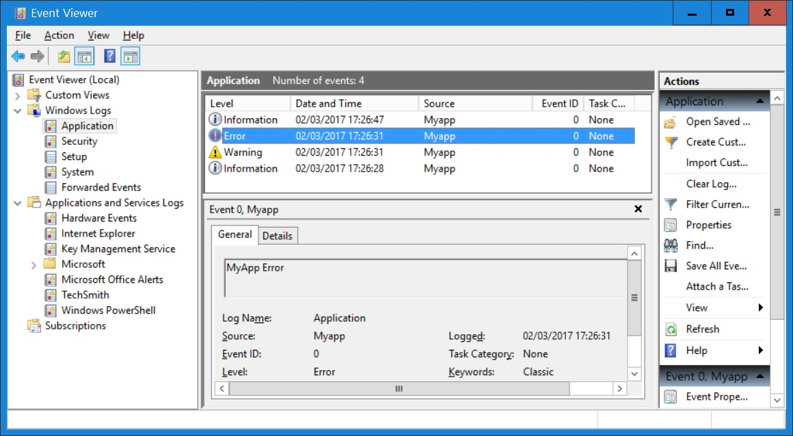

# The Windows Event Log

Now that we have managed to establish `MyApp` as a Windows Service we have to make sure that it behaves. That means we need to make it report to the Windows Event Log.

## What exactly is the Windows Event Log?

In case you've never heard of it, or you are not sure what exactly the purpose of it is, this is for you; otherwise jump to "Why is the Windows Event Log important?".

The Windows Event Log is by no means an alternative to application specific log files. Most ordinary applications do not write to the Windows Event Log at all, some only when things go wrong and very few always. In other words, for ordinary applications you may or may not find useful information in the Windows Event Log, but the likelihood is slim.

That's very different for any application that runs as a Windows Service: those are expected to write to the Windows Event Log when it starts, when it quits and when it encounters problems, and it might add even more information. You will find it hard to find an exception.

Similarly Scheduled Tasks are expected to do the same, although some don't, or report just errors.

## Is the Windows Event Log important?

On a server all applications run either as Windows Services (most likely all of them) or as Windows Scheduled Tasks. Since no human is sitting in front of a server we need a way to detect problems on servers automatically. That can be achieved by using software that constantly scans the Windows Event Logs of all given computers. It can email or text admins when an application that's supposed to run doesn't, or when an application goes astray, drawing attention to that server.

So yes, the Windows Event Log is indeed really important.

## How to investigate the Windows Event Log

In modern versions of Windows you just press the Win key and then type "Event". That brings up a list which contains at least "Event Viewer".

By default the Event Viewer displays all Event Logs on the current (local) machine. However, you can connect to another computer and investigate its Event Log, rights permitted. We keep it simple and focus just on the local Windows Event Log.

## Terms used

From the Microsoft documentation: "Each log in the Eventlog key contains subkeys called event sources. The event source is the name of the software that logs the event. It is often the name of the application or the name of a subcomponent of the application if the application is large. You can add a maximum of 16,384 event sources to the registry. The Security log is for system use only. Device drivers should add their names to the System log. Applications and services should add their names to the Application log or create a custom log." [^winlog]

## Application log versus custom log

The vast majority of applications that write to the Windows Event Log write into "Windows Logs\Application", but if you wish you can create your own log under "Applications and services logs". However, be aware that for creating a custom log you need admin rights. Therefore creating a custom log is something that is usually done by the installer installing your software since that needs admin rights by definition anyway.

We keep it simple here and write to the "Application" log.

## Let's do it

Copy `Z:\code\v13` to `Z:\code\v14`.

### Loading WindowsEventLog

We are going to enable `MyApp` to write to the Windows Event Log only when it runs as a Service. Therefore we need to load the module `WindowsEventLog` from within `MakeService.dyapp` (but not `MyApp.dyapp`):

~~~
...
Load ..\AplTree\OS
leanpub-start-insert  
Load ..\AplTree\WindowsEventLog
leanpub-end-insert  
Load ..\AplTree\Logger
...
~~~

### Modify the INI file

We need to add a flag to the INI file that allows us to toggle writing to the Window Event Log:

~~~
...
[Ride]
Active      = 0
Port        = 4502

leanpub-start-insert  
[WindowsEventLog]
write       = 1 ; Has an affect only when it's running as a Service
leanpub-end-insert  
~~~

Why can this be useful? During development, when you potentially run the Service in order to check what it's doing, you might not want the application to write to your Windows Event Log, for example.

### Get the INI entry into the "Config" namespace

We modify the `MyApp.CreateConfig` function so that it creates `Config.WriteToWindowsEventLog` from that INI file entry:

~~~
∇ Config←CreateConfig isService;myIni;iniFilename
... 
      :If isService
          Config.WatchFolders←⊃myIni.Get'Folders:Watch'
leanpub-start-insert
          Config.WriteToWindowsEventLog←myIni.Get'WINDOWSEVENTLOG:write'
leanpub-end-insert
      :Else
          Config.LogFolder←'expand'F.NormalizePath⊃Config.LogFolder myIni.Get'Folders:Logs'
leanpub-start-insert
          Config.WriteToWindowsEventLog←0
leanpub-end-insert          
      :EndIf
...
∇

~~~

### The functions "Log" and "LogError"

For logging purposes we introduce two new functions, `Log` and `LogError`. First `Log`:

~~~
∇ {r}←{both}Log msg
 ⍝ Writes to the application's log file only by default.
 ⍝ By specifying 'both' as left argument one can force the fns to write
 ⍝ `msg` also to the Windows Event Log if Config.WriteToWindowsEventLog.
   r←⍬
   both←(⊂{0<⎕NC ⍵:⍎⍵ ⋄ ''}'both')∊'both' 1
   :If 0<⎕NC'MyLogger'
       MyLogger.Log msg
   :EndIf
   :If both
   :AndIf Config.WriteToWindowsEventLog
       :Trap 0    ⍝ Don't allow logging to break!
           MyWinEventLog.WriteInfo msg
       :Else
           MyLogger.LogError'Writing to the Windows Event Log failed for:'
           MyLogger.LogError msg
       :EndTrap
   :EndIf
∇
~~~

Note that this function always writes to the application's log file. By specifying "both" as left argument one can enforce the function to also write to the Windows Event Log, given that `Config.WriteToWindowsEventLog` is true. That allows us to use `Log` for logging all events but errors, and to specify "both" as left argument when we want the function to record the Service starting, pausing and stopping. In other words, all calls to `MyLogger.Log` will be replaced by `Log`, although some calls require "both" to be passed as left argument.

We also introduce a function `LogError`:

~~~
∇ {r}←LogError(rc msg)
 ⍝ Write to **both** the application's log file and the Windows Event Log.
   MyLogger.LogError msg
   :If Config.WriteToWindowsEventLog
       :Trap 0
           MyWinEventLog.WriteError msg
       :Else
           MyLogger.LogError'Could not write to the Windows Event Log:'
           MyLogger.LogError msg
       :EndTrap
   :EndIf
∇
~~~

Note that the `Logger` class traps any errors that might occur. The `WindowsEventClass` does not do this, and the calls to `WriteInfo` and `WriteError` might fail for all sorts of reasons: invalid data type, invalid depth, lack of rights, you name it. Therefore both `Log` and `LogError` trap any errors and write to the log file in case it goes wrong. Note also that in this particular case it's appropriate to trap all possible errors (0) because we cannot possibly foresee what might go wrong.

In case of an error we now want the function `LogError` to be called, so `SetTrap` needs an adjustment:

~~~
∇ trap←{force}SetTrap Config
...
  #.ErrorParms.returnCode←EXIT.APPLICATION_CRASHED
leanpub-start-insert  
  #.ErrorParms.(logFunctionParent logFunction)←⎕THIS'LogError'
leanpub-end-insert  
  #.ErrorParms.windowsEventSource←'MyApp'
...
∇
~~~

Now it's time to replace the call to `MyLogger.Log` by a call to `Log` in the `MyApp` class; use the "Replace" feature of the editor in order to achieve that.

There are however three functions where we need to add `'both'` as left argument to some calls to `Log`:

~~~
∇ {r}←MainLoop port;S
  r←⍬
leanpub-start-insert
  'both'Log'"MyApp" server started'
leanpub-end-insert
  S←#.ServiceState
  :Repeat
      CheckForRide 0 port
      LoopOverFolder ⍬
leanpub-start-insert
      :If ('both'∘Log S.CheckServiceMessages)S.IsRunningAsService
          'both'Log'"MyApp" is about to shut down...'
leanpub-end-insert
          :Leave
      :EndIf
      ⎕DL 2
  :Until 0
 ⍝Done
∇
~~~

Note that we have to make use of the "compose" (`∘`) operator here: only by "gluing" the left argument (`'both'`) to the function name with the compose operator can we make sure that everything that's passed on to the `Log` function will be written not only to the log file but also to the Windows Event Log when `ServiceState` is managing the communication between the SCM and the application.

The second function to be changed is `Off`:

~~~
    ∇ Off exitCode
      :If exitCode=EXIT.OK
leanpub-start-insert
          'both'Log'Shutting down MyApp'
leanpub-end-insert          
      :Else
~~~

Now we change `Initial`: in case the application is running as a service we let `Initial` create an instance of `WindowsEventLog` and return it as part of the result.

~~~
leanpub-start-insert
∇ r←Initial isService;parms;Config;MyLogger;MyWinEventLog
leanpub-end-insert
⍝ Prepares the application.
  #.⎕IO←1 ⋄ #.⎕ML←1 ⋄ #.⎕WX←3 ⋄ #.⎕PP←15 ⋄ #.⎕DIV←1
  Config←CreateConfig isService
  Config.ControlFileTieNo←CheckForOtherInstances ⍬
  CheckForRide(0≠Config.Ride)Config.Ride
  MyLogger←OpenLogFile Config.LogFolder
leanpub-start-insert
  Log'Started MyApp in ',F.PWD
  Log 2 ⎕NQ'#' 'GetCommandLine'
  Log↓⎕FMT Config.∆List
leanpub-end-insert
  r←Config MyLogger
  :If isService
leanpub-start-insert
      MyWinEventLog←⎕NEW #.WindowsEventLog(,⊂'MyAppService')
leanpub-end-insert
      parms←#.ServiceState.CreateParmSpace
      parms.logFunction←'Log'
      parms.logFunctionParent←⎕THIS
      #.ServiceState.Init parms
leanpub-start-insert
      r,←MyWinEventLog
leanpub-end-insert
  :EndIf
∇
~~~

`Initial` is called by `RunAsService` and `StartFromCmdLine` but because the result of `Initial` remains unchanged if the application is not running as a Service we need to amend just `RunAsService`. We localize `MyWinEventLog` (the name of the instance) and change the call to `Initial` since it now returns a three-item vector:

~~~
leanpub-start-insert
∇ {r}←RunAsService(earlyRide ridePort);⎕TRAP;MyLogger;Config;∆FileHashes;MyWinEventLog
leanpub-end-insert
 ⍝ Main function when app is running as a Windows Service.
...
  ⎕TRAP←#.HandleError.SetTrap ⍬
leanpub-start-insert  
  (Config MyLogger MyWinEventLog)←Initial 1
leanpub-end-insert  
  ⎕TRAP←(Config.Debug=0)SetTrap Config
...  
∇
~~~

### Does it still work?

Having made all these changes we should check whether the basics still work:

1. Double-click `Make.bat` in order to re-compile the EXE.
1. Double-click `MyApp.dyapp`. This assembles the workspace, including the test cases.
1. Answer the question whether all test cases shall be executed with "y".

Ideally the test cases should pass.

Now it's time to run the test cases for the Service:

1. Open a console window with admin rights.
1. Navigate to the `v14\` folder.
1. Call `MakeService.dyapp`.
1. Execute `TestsForServices.GetHelpers`.
1. Call `TestsForServices.RunDebug 0`.

Now start the Event Viewer; you should see something like this:

You might need to scroll down a bit.

### Adding a test case

We shall add a test case that checks whether the new logging feature works. For that we introduce `Test_03`:

~~~
∇ R←Test_03(stopFlag batchFlag);⎕TRAP;MyWinLog;noOfRecords;more;rc;records;buff
  ⍝ Start & stop the service, then check the Windows Event Log.
  ⎕TRAP←(999 'C' '. ⍝ Deliberate error')(0 'N')
  R←∆Failed
 
  MyWinLog←⎕NEW #.WindowsEventLog(,⊂'MyAppService')
  noOfRecords←MyWinLog.NumberOfLogEntries
 
  (rc more)←∆Execute_SC_Cmd'start'
  →FailsIf 0≠rc
  ∆Pause 1     
  (rc more)←∆Execute_SC_Cmd'query'
  →FailsIf 0=∨/'STATE : 4 RUNNING'⍷#.APLTreeUtils.dmb more
  ∆Pause 2
 
  (rc more)←∆Execute_SC_Cmd'stop'
  →FailsIf 0≠rc
  ∆Pause 2
 
  records←(noOfRecords-10)+⍳(MyWinLog.NumberOfLogEntries+10)-noOfRecords
  buff←↑MyWinLog.ReadThese records  
  →PassesIf∨/,'"MyApp" server started '⍷buff
  →PassesIf∨/,'Shutting down MyApp'⍷buff
 
  R←∆OK
∇
~~~

Notes:

1. First we save the number of records currently saved in the Windows Event Log "Application".
1. We then start and stop the server in order to make sure that we get some fresh records written.
1. We then read the number of records plus 10 (others write to the Windows Event Log as well) and investigate them.

## Tips, tricks and traps

No doubt you feel now confident with the Windows Event Log, right? Well, keep reading:

* When you create a new source in a (new) custom log then in the Registry the new log is listed as expected but it has _two_ keys, one carrying the name of the source you intended to create and a second one with the same name as the log itself. In the Event Viewer however only the intended source is listed.

* The names of sources must be _unique_ across _all_ logs.

* Only the first 8 characters of the name of a source are really taken into account; everything else is ignored. That means that when you have a source `S1234567_1` and you want to register `S1234567_2` you will get an error "Source already exists".

* When the Event Viewer is up and running and you either create or delete a log or a source and then press F5 then the Event Viewer GUI flickers, and you might expect that to be an indicator for the GUI having updated itself; however, that's not the case, at least not at the time of writing (2017-03). You have to close the Event Viewer and re-open it to actually see your changes.

* Even when your user ID has admin rights and you've started Dyalog in elevated mode ("Run as administrator" in the context menu) you _cannot_ delete a custom log with calls to `WinReg` (the APLTree member that deals with the Windows Registry). The only way to delete custom logs is with the Registry Editor: go to the key

  `HKEY_LOCAL_MACHINE\SYSTEM\CurrentControlSet\Services\EventLog\`
  
  and delete the key(s) (=children) you want to get rid of. It's not a bad idea to create a system restore point [^restore] before you do that. By the way, if you never payed attention to System Restore Points you really need to follow the link because under Windows 10 System Restore Points are not generated automaticelly by default any more; you have to switch them on explicitly.
  
* Once you have written events to a source and then deleted the log the source pretends to belong to, the events remain saved anyway. They are just not visible anymore. That can be proven by re-creating the log: all the events make a come-back and show up again as they did before. 

  If you really want to get rid of the logs then you have to select the "Clear log" command from the context menu in the Event Viewer (tree only!) before you delete the log.

* If you want to analyze the contents of a log in APL you will find the instance methods `Read` (which reads the whole log) and `ReadThese` (which takes line numbers and reads just them) useful. 
 

[^winlog]: Microsoft on the Windows Event Log: <https://msdn.microsoft.com/en-us/library/windows/desktop/aa363648(v=vs.85).aspx>
 
[^restore]: Details about System Restore Point: <https://en.wikipedia.org/wiki/System_Restore>