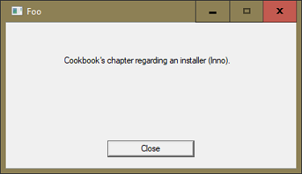

{:: encoding="utf-8" /}
[parm]:title     = 'Installer'                                              
[parm]:linkToCSS = 1                                                        

# Creating SetUp.exe with Inno

Defining the goal
------------------

Our application is now ready for being installed on a client's machine. What we need is a piece of software that does a couple of things for us:

1. Collect all the files that need to go onto a client's machine.
1. Create a file `SetUp.exe` (you might choose a different name) that contains the program that is capable of installing our application on a client's machine and also carries all those files after compressing them.

There are many more things an installer might or might not do, but these are the essential tasks.

Which tool
----------

There are quite a number of installers available. The market leader seems to be Wix[^wix] which is a must in case you need to roll out your software to large corporations.

Wix is very powerful, but the power has a price: it's also very complex. We reckon that you start smaller than with large corporations; if this assumption is wrong it would mean you are most likely in a position that allows you to hire a professional doing the job for you anyway.

To start smaller means choosing a tool that is less complicated and can be mastered fast. Inno has made a name for itself as a tool that combines powerful features with an easy-to-use interface.

To download Inno visit <http://www.jrsoftware.org/isdl.php>. We suggest to go for the "QuickStart Pack". That does not only install the Inno compiler and its help but also Inno Script Studio from Kymoto (<https://www.kymoto.org/>).

It also comes with an encrypting DLL although we don't see the point of encrypting the installer. After the installation has been carried out a user can access all the files anyway.

The Script Studio does not only make it easier to use Inno, it comes also with a debugger which can be very helpful if you want to get to the bottom of a problem.

Note that both packages are free, even for commercial usage. However, you are encouraged to donate to both Inno and Script Studio as soon as you start to make money with your software.

Inno and Script Studio
----------------------

The easiest way to start with Inno is to take an existing script and study it. Trial and error and Inno's old-fashioned looking but otherwise excellent help are your friends.

Sources of information
----------------------

When you run into an issue or need badly a particular feature then googling for it is of course a good idea, even better than referring to Inno's help: the help is excellent as a reference, you just type a term you need help with and press F1, but in case you don't know exactly what to search for Google is your friend. 

You will find that Google often enough suggests Inno's help anyway, but Google gets you straight to the right page. In other words, Google does an excellent job when you search for something like "Inno src".

We found that's enough to get advice on all the problems we've run into while getting acquainted to Inno.

Considerations
--------------

Normally an installer needs by definition admin rights. That's because installing a program is a potentially dangerous thing. 

I> It is pretty rare to install an application in an unusual place like, say, `C:\MyFolder`. Under those rare circumstances it might be possible to install an application without admin rights.
I>
I> However, even installing a font requires admin rights.

Programs are usually installed in one of:

* `C:\Program Files` 
* `C:\Program Files (x86)`

Those directories are protected by Windows, and only an administrator can therefore install programs, although an installer might well do other things that require more rights than the usual user account has, for example...

* installing a Windows Service
* creating an Event Log 
* create certain entries in the Windows Registry

Again you must consider where certain things should be written to. Log files cannot and should not go into either `C:\Program Files` and `C:\Program Files (x86)`, so they need to go elsewhere. 

Let's assume that we want to install an application "Foo". These are your options: create a folder `Foo` within...

* `C:\ProgramData`
* `C:\Users\{username}\AppData\Local`
* `C:\Users\{username}\AppData\Roaming`

The `Roaming` folder is the right choice if a user wants the application to be available no matter on which computer she logs on to.

A> # About C:\ProgramData
A> There is only one difference between the "AppData" and the "ProgramData" folders: every user has its own "AppData" folder but there is only one "ProgramData" folder which is therefore shared by all users.
A>
A> The folder `C:\ProgramData` is hidden by default, so you will see it only when you tick the "Hidden items" check box on the "View" tab of the Windows Explorer.

Of course you can put that folder in any place you want --- as long as you own the necessary rights --- but by choosing one of these two locations you stick to what's usual under Windows.

Sample application
------------------

We use a very simple application for this chapter: the application "Foo" just puts up a form:

As soon as you press either <enter> or <escape> or click the "Close" button it will quit. That's all it is doing.

The application comes with several files. This is a list of <http://cookbook.dyalog.com/code/v16/>:

`Foo.dws`

: The workspace from which `Foo.exe` was created with the File > Export menu command.

`Foo.exe`

: The application's EXE, created from the aforementioned workspace.

`foo.ico`

: The icon used by the application

`Foo.iss`

: The Inno file that defines how to create the installer EXE. It is this file we are going to discuss in detail.

`foo.ini.remove_me`

: Foo's INI file.

`ReadMe.html`

: An HTML with basic information about the application.

: With the exception of `Foo.exe` and `Foo.iss` the file are included for illustrating purposes only. The INI file for example is not processed at all by Foo.

Using Inno
----------

Before we go into any details let's briefly look at a typical Inno script.

### Structure of an Inno script

Inno requires, similar to good old fashioned INI files, a number of sections:

Setup
: In this section you are supposed to define constants that carry all the pieces of information that are specific to your application. There should be no other place where, say, a path or a filename is specified; that should all be done in the `[Setup]` section.

Language
: Used to define the language and the message file.

Registry
: This section can be used to write information to the Windows Registry.

Dirs
: Used to define constants that point to particular directories, and to specify permissions.

Files
: Specifies all the files that are going to be collected within `SetUp.exe`.

Icons
: Specifies the icons that are required.

Run
: Run other programs, either during installation or afterwards.

Tasks
: Add check boxes or radio buttons to the installation wizard's windows so that the user can decide whether those tasks should be carried out or not.

Code
: Used to define programs in a scripting language similar to Pascal for doing more complex things.

: Inno has powerful built-in capabilities which allow us to reach all our goals without writing any code, therefore we won't use the scripting capabilities. Note however that for many common tasks there are scripts available on the Internet.

### The file `Foo.iss`

`Foo.iss` does not cover anything fancy, but it does cover the normal stuff. Note that the file has the extension ".iss" - that's Inno's extension. Therefore double-clicking it should bring up Inno Script Studio which does not only act as a special editor, it also allows you to execute the script, and it comes with debugging features as well.

### Defining variables

It is recommended to define some variables at the top of any Inno script which will later be used one or more times.

This technique allows to reduce typing and is a safeguard against typos.

~~~
#define MyAppVersion "1.0.0"
#define MyAppName "Foo"
#define MyAppExeName "Foo.exe"
#define MyAppPublisher "My Company Ltd"
#define MyAppURL "http://MyCompanyLtd.com/Foo"
#define MyAppIcoName "Foo.ico"
#define MyBlank " "
~~~

`MyBlank` is included in order to improve readability: without it it can be difficult to spot a blank character in a name or path.

### The section [Setup]

~~~
[Setup]
; NOTE: The value of AppId uniquely identifies this application.
; It's a 36-character long vector called a UUID or GUID. 
AppId={{E0DF5CAB-97E5-4935-A2ED-A7D43DD958D9} 

AppName="{#MyAppName}"
AppVersion={#MyAppVersion}
AppVerName={#MyAppName}{#MyBlank}{#MyAppVersion}
AppPublisher={#MyAppPublisher}
AppPublisherURL={#MyAppURL}
AppSupportURL={#MyAppURL}
AppUpdatesURL={#MyAppURL}
DefaultDirName={pf32}\{#MyAppPublisher}\{#MyAppName}
DefaultGroupName={#MyAppPublisher}\{#MyAppName}
AllowNoIcons=yes
OutputDir=ReadyToShip\Foo
OutputBaseFilename="SetUp_{#MyAppName}"
Compression=lzma
SolidCompression=yes
SetupIconFile={#MyAppIcoName}
UninstallDisplayIcon={app}\{#MyAppIcoName}
~~~

We don't discuss every single topic here because their names should make it pretty obvious what they are used for. It is worth mentioning however that all those names _must_ be be defined: Inno needs them.

Notes:

* The variables defined at the top of the Inno script (before the first section) are referred to here by `{#varsname}`.

* The `AppId` is used to identify an application, in particular for un-installing it. It can be anything as long as it is less than 128 characters long but using a GUID[^guid] is not a bad idea at all. Tip: don't add a version number to it.

  Note that you can create a GUID from within Inno Script Studio: check the Tools > Generate GUID menu command.

*  `pf32` is an internal Inno constant. The name stands for "The 32-bit program folder" which defaults to `C:\Program folder (x86)`.

   If you want it to be a 64-bit application then use `pf64` instead. Don't use `pf`: although this has a default and therefore might work it's just not obvious, so it's better to avoid this and be explicit.

* `AllowNoIcons←1` will add a check box "Don't create a Start Menu folder" to the installer. That leaves it to the user whether the installer should create such a folder and under which name.

* `app` is a constant that points to the folder where the user wants to install the application. It defaults to `DefaultDirName` which is just a suggestion the user might or might not accept. 

  However, whatever the user decides, `app` will point to that folder. In other words, the user might choose a different folder, but whatever she does, `app` is pointing to that folder.

### The section [Languages]

~~~
[Languages]
Name: "english"; MessagesFile: "compiler:Default.isl"; \
  LicenseFile: "License.txt"; \
  InfoBeforeFile: "ReadMe_Before.txt"; \
  InfoAfterFile: "ReadMe_After.txt";
~~~

Inno supports multilingual  installations. However, this is beyond the scope of this chapter. We define just one language here. The parameters for a single language must be defined on a single line but you can avoid very long lines by splitting them with a `\` at the end of a line as shown above.

While the two parameters `Name` and `MessageFile` are mandatory the other three parameters are optional:

* `LicenseFile` 
* `InfoBeforeFile`
* `InfoAfterFile`

When we execute `Setup.exe` you will see when exactly the contents of them is displayed. Note that if `LicenseFile` is defined the user must accept the conditions, otherwise she cannot go ahead.

### The section [Registry]

~~~
[Registry]
Root: HKLM32; Subkey: "Software\{#MyAppPublisher}"; Flags: uninsdeletekeyifempty
Root: HKLM32; Subkey: "Software\{#MyAppPublisher}\{#MyAppName}"; Flags: uninsdeletekey
Root: HKLM32; Subkey: "Software\{#MyAppPublisher}\{#MyAppName}"; \
  ValueType: string; ValueName: "RecentFiles"; ValueData: ""; Flags: uninsdeletekey
~~~

This section allows you to add settings to the Windows Registry.

Notes:

* With `Root:` you define the root key. See the chapter [The Windows Registry: root keys](./15%20The%20Windows%20Registry.html#root-keys]) for details which root keys you may specify.
* With `Subkey` you define the remaining part but the value.
* What's a `Value` in Microsoft speech is called `ValueName` by Inno.
* The actual data is called `ValueData` by Inno.
* `ValueType` specifies the data type of `ValueData`. Note that without `ValueType` being specified (or it being "none") Inno will create the key but _not_ the value.

   Inno supports the following data types:
   * none
   * string
   * expandsz
   * multisz
   * dword
   * qword
   * binary

  For details refer to the Inno help regarding the `[Registry]` setting.
* The keyword `uninsdeletekey` tells Inno that it is supposed to delete the Registry key when the application is uninstalled. Without that keyword Inno would **not** delete any Registry keys and values when the application is uninstalled.
* The `uninsdeletekeyifempty` keyword is similar but let Inno delete the Registry key only when it is empty. 

  This comes handy when you use the Registry for saving user preferences: as long as the user has not defined any preferences the key can be deleted safely. If she has then you might consider leaving them alone. After all the user might uninstall just in order to install a better version, expecting her preferences to survive the procedure.

### The section [Dirs]

~~~
[Dirs]
Name: "{commonappdata}\{#MyAppName}"; Permissions: users-modify
~~~

From the Inno Help:

> This optional section defines any additional directories Setup is to create besides the application directory the user chooses, which is created automatically. Creating subdirectories underneath the main application directory is a common use for this section.

With the above line we tell Inno to create a folder `{#MyAppName}` which in our case will be "My Company Ltd". Note that `commonappdata` defaults to `ProgramData\`, usually on the `C:\` drive. Instead we could have used `localappdata` which defaults to `C:\Users\{username}\AppData\Local`. There are many more constants available; refer to "Constants" in the Inno Help for details.

We also tell Inno that it should give any user who belongs to the "Users" group the right to modify files in this directory.

W> Of course you are not supposed to grant "modify" rights to the folder where your application's EXE lives, let alone to folders that are not associated with your application.

Note that in case you install the application _again_ then the folder **won't** be created, and you won't see an error message either.

### The section [Files]

~~~
[Files]
Source: "ReadMe.html"; DestDir: "{app}";
Source: "Foo.ico"; DestDir: "{app}";
;Source: "bridge160_unicode.dll"; DestDir: "{app}";
;Source: "dyalognet.dll"; DestDir: "{app}";
Source: "{#MyAppExeName}"; DestDir: "{app}";
Source: "foo.ini.remove_me"; DestDir: "{app}"; DestName:"foo.ini"; Flags: onlyifdoesntexist;
Source: {#MyAppIcoName}; DestDir: "{app}";
Source: "C:\Windows\Fonts\apl385.ttf"; DestDir: "{fonts}"; FontInstall: "APL385 Unicode"; Flags: onlyifdoesntexist uninsneveruninstall
; NOTE: Don't use "Flags: ignoreversion" on any shared system files

; ----------- For Ride: ---------------
;Source: "Conga*.dll"; DestDir: "{app}";
; -------------------------------------
~~~

We have included here a number of files that are quite common in any APL application:

* These days you see the `ReadMe.html` frequently.
* The icon is used by the GUI.
* The `bridge*` as well as the `DyalogtNet.dll` are needed in case you want to use even the most simple .NET call.
* Naturally the EXE needs to be included.
* The file `foo.ini.remove_me` is included as well but will be renamed to `foo.ini` but only when it does not already exist.

  That way you make sure that any already existing INI file is not overwritten. This is an important step in case the user installs a better version over an already existing one.
* With `{#MyAppIcoName}; DestDir: "{app}";` you make sure that a folder etc is inserted into the Start menu. However, you may allow the user to have a say on this; refer to "AllowNoIcons" in the "[The section [SetUp]](#)".
* We include the font "APL385 Unicode" but only if it does not already exist (`onlyifdoesntexist`) and we make sure that the font is not uninstalled even if the application is (`uninsneveruninstall`).
* Note that in case you want to Ride into your application you also need to include the Conga DLLs. Usually this well be done only while the application is still under development or is tested.

### The section [Icons]

~~~
[Icons]
Name: "{group}\Start Foo"; Filename: "{app}\{#MyAppExeName}"; WorkingDir: "{app}\";  IconFilename: "{app}\{#MyAppIcoName}" 
Name: "{commondesktop}\{#MyAppName}"; Filename: "{app}\{#MyAppExeName}"; IconFilename: "{app}\{#MyAppIcoName}"; Tasks: desktopicon
~~~

The first line inserts group and application name into the Windows Start menu. Read up on "group" in the Inno help for details what the group names means and where it is installed; there are differences between users who install the application with admin rights and those who don't.

### The section [Run]

~~~
[Run]
Filename: "{app}\ReadMe.html"; Description: "View the README file"; Flags: postinstall shellexec skipifsilent
Filename: "{app}\{#MyAppExeName}"; Description: "Launch Foo"; Flags: postinstall skipifsilent nowait
~~~

Notes:

* The first entry displays the file "ReadMe.html" with the default browser (`shellexec` on an HTML file) after the application has been installed (`postinstall`).

  If the command line options `silent` or `verysilent` are specified then "ReadMe.html" is **not** put on display (`skipifsilent`).

* The second entry offers to launch the application after the installation (`postinstall`) but only if neither `silent` nor `verysilent` were specified (`skipifsilent`) and Inno is not waiting for the application (`nowait`).

* Both entries are offered as check boxes which are ticked by default; the user might un-tick them in order to prevent the associated action from being carried out.

### The section [Tasks]

~~~
[Tasks]
Name: "desktopicon"; Description: "{cm:CreateDesktopIcon}"; GroupDescription: "{cm:AdditionalIcons}";
~~~

From the Inno help:

> This section is optional. It defines all of the user-customizable tasks Setup will perform during installation. These tasks appear as check boxes and radio buttons on the Select Additional Tasks wizard page.

In our example we specify only one task, and it's linked to `desktopicon` (see the [Icons] section).

However, this is a much more powerful feature than it looks like at first glance! For example, you can give the user a choice between installing the...

* application
* database engine
* test data

or any combination of them. 

In order to achieve that you need to add the (optional) section `[Components]` and list all the files involved there. You can then create additional lines in the `[Task]` section that link to those lines in `[Components]`. The user is then presented a list of check boxes that allow her to select the options she's after.

Note that `cm:CreateDesktopIcon` refers to a message `CreateDesktopIcon` which can be modified if you wish so; the `cm` stands for "Custom Message". For that you would insert the (optional) section `[CustomMessages]` like this:

~~~
[CustomMessages]
CreateDesktopIcon = This and that
~~~

That would overwrite the internal message.

### The section [Code]

Inno comes with a built-in script language that allows you to do pretty much whatever you like. However, scripting is beyond the scope of this chapter.

Conclusion
----------

Although Inno is significantly easier to master than the top dog Wix is offers a large array of features and options. This chapter is just scratching the surface, but it should be enough to get you going.

[^wix]:<http://wixtoolset.org/>:
Windows Installer

[^guid]:<https://blogs.msdn.microsoft.com/oldnewthing/20080627-00/?p=21823/>:
About GUIDs