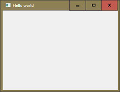
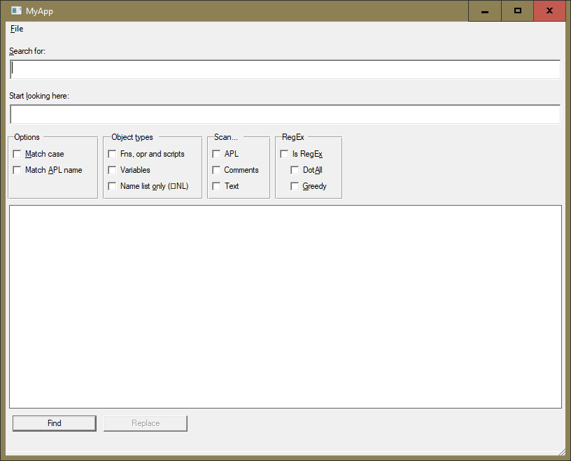

{:: encoding="utf-8" /}

# User interface 

Modern graphical user interfaces (GUIs, or more simply, UIs) are a wonder. UI conventions are so widely known it is now unremarkable for people to start using applications without prior training, expecting the software to make clear what they need to do. 

This is a high standard to meet, and writing UIs is a deep art. The primary platforms for professional writers of UIs are currently a combination of HTML 5 and JavaScript (HTML/JS) and Windows Presentation Foundation (WPF). These are rich platforms, which enable effective and attractive UIs to be written. 

The high quality of these UIs is particularly important for mass-market software, where users are unskilled and unsupported. 

HTML/JS and WPF have a high learning threshold. There is much to be mastered before you can write good UIs on these platforms. 

You have an alternative. The GUI tools native to Dyalog support perfectly workmanlike GUIs. They exploit and extend your existing knowledge of Dyalog. If you are producing high-value software for a few users, rather than software for casual use by millions, a native Dyalog GUI might be your best platform.

You can still run your application from within a browser if you wish to: Amazon offers the "AppStream" [^appstream] service allowing exactly that.

Creating a GUI form in Dyalog could hardly be simpler:

~~~
      UI←⎕NEW⊂'Form'
      UI.Caption←'Hello world'
~~~      

To the form we add controls, set callback functions to run when certain events occur, and invoke the form's `Wait` method or invoke `⎕DQ`. See the _Dyalog for Microsoft Windows Interface Guide_ for details and tutorials. 

## A sample Form

We are going to implement a sample form that looks like this:

We keep this separate from the application we have developed so far, and we are not using scripts

### Collecting controls

We are not using a designer for that, we use APL code. We start with a container that will collect the names of most if not all the controls we are about to create. That container is a namespace. We suggest to use a short name, because you will refer to this name very often. Let's name it `n` like "names" as in `n←⎕NS ''`. We do this because the hierarchy of the controls is not of much interest to us, we are happy to refer to them by a simple name. 

We will create the different controls in dedicated functions. Experience has shown that this is more readable and easier to maintain (in case a re-design of the GUI is needed) than any other approach. Before we start to produce code we create a namespace `GUI` in the root that will hold all forms, and each form will have its own sub namespace:

~~~
      'GUI. #.⎕NS''
      'Sample_01' #.GUI.⎕NS ''
      )cs #.GUI.Sample_01
~~~

Let's start with a function that creates the whole form. Since we have already jumped into `#.GUI.Sample_01` we can create this function "locally":

~~~
∇ n←CreateGUI dummy
  n←⎕NS ''
  n←CreateMainForm n
  n←CreateSearch n
  n←CreateReplace n
  n←CreateOptionGroup n
  n←CreateScanGroup n
  n←CreateRegExGroup n
  n←CreatePushButtons n
∇
~~~

For the time being we create the `n` namespace with `⎕NS`. Later we will introduce a class that lives in `#.GUI` which not only creates a newnamespace but populates that namepsace with some useful methods.

~~~

~~~

## A simple UI with native Dyalog forms

A new namespace script, UI in which a niladic function `Run` runs the user interface:

~~~
   ⍝ aliases
    (A E F)←#.(APLTreeUtils Environment FilesAndDirs)
    (M R U)←#.(MyApp RefNamespace Utilities)

    ∇ Run;ui
      ui←R.Create'User Interface'
      ui←CreateGui ui
      ui←Init ui
      ui.∆Path←F.PWD
      DQ ui.∆form
      Shutdown
     ⍝ done
    ∇
~~~    

Here we see the outline clearly. An instance of the RefNamespace class is assigned to `ui`. It is a namespace, empty apart from some standard methods -- 
try `]ADoc #.RefNamespace` to see details. 

Functions `CreateGui` and `Init` build and initialise the user interface encapsulated in `ui`. Neither function needs to return a result, but doing so means the functions could be chained, for example:

      ui←Init CreateGui R.Create'User Interface'

### Forms

Again, the functional style of `CreateGui` produces expository code. 

~~~
    ∇ ui←CreateGui ui
      ui.∆LanguageCommands←''
      ui.∆MenuCommands←''
     
      ui←CreateForm ui
      ui←CreateMenubar ui
      ui←CreateEdit ui
      ui←CreateStatusbar ui
    ∇
~~~    

The UI namespace gets a couple of empty lists as properties: `∆LanguageCommands` and `∆MenuCommands`. We'll come to those in the menu bar. 

Creating the form is also straightforward:

~~~
    ∇ ui←CreateForm ui;∆
      ui.Font←⎕NEW'Font'(('Pname' 'APL385 Unicode')('Size' 16))
      ui.Icon←⎕NEW'Icon'(E.IconComponents{↓⍉↑⍵(⍺⍎¨⍵)}'Bits' 'CMap' 'Mask')
     
      ∆←''
      ∆,←⊂'Coord' 'Pixel'
      ∆,←⊂'Posn'(50 70)
      ∆,←⊂'Size'(400 500)
      ∆,←⊂'Caption' 'Frequency Counter'
      ∆,←⊂'MaxButton' 0
      ∆,←⊂'FontObj'ui.Font
      ∆,←⊂'IconObj'ui.Icon
      ui.∆form←⎕NEW'Form'∆
      ui.∆form.ui←ui
    ∇
~~~    

But notice key moves in the last two lines. When the form is created, its reference is assigned to a new property of the UI namespace: `∆form`. And, as will all its children, the form is given, as property `ui`, a reference to the UI namespace. 

It follows, from any control `obj` in the UI, the form can be referred to as `obj.ui.∆form`. 

We'll see this first in creating the menubar. 

### Controls

Here we create a menubar as a child of the form, which we can refer to as `ui.∆form`. A reference to the menubar is saved in the UI namespace under the name `MB`. 

~~~
    ∇ ui←CreateMenubar ui
      ui.MB←ui.∆form.⎕NEW⊂'Menubar'
     
      ui←CreateFileMenu ui
      ui←CreateLanguageMenu ui
     
      ui.∆MenuCommands.onSelect←⊂'OnMenuCommand'
      ui.∆MenuCommands.ui←ui
    ∇
~~~    

When both menus have been made, the callback `OnMenuCommand` is set for all the objects in the list `ui.∆MenuCommands`. Presumably that list was populated as a side effect of `CreateFileMenu` and/or `CreateLanguageMenu`. Just so:

~~~
    ∇ ui←CreateFileMenu ui
      ui.MenuFile←ui.MB.⎕NEW'Menu'(⊂'Caption' '&File')
     
      ui.Quit←ui.MenuFile.⎕NEW'MenuItem'(⊂'Caption'('Quit',(⎕UCS 9),'Alt+F4'))
      ui.∆MenuCommands,←ui.Quit
    ∇
~~~    

Just so: the menu item Quit is created as a child of the File menu, and a reference to it appended to `ui.∆MenuCommands`. 

The Language menu has to be created dynamically from the languages defined in `#.MyApp.ALPHABETS`. 

In principle we have a serious potential problem here. We're assigning menu items to alphabet names in the UI. The alphabet names are drawn from (among other sources) INI files. They could conflict with names defined during `CreateGui`. Although that seems highly unlikely, we should encapsulate the language names in their own namespace. For now, we've left a comment on the line that might break, and wrapped the assignment in a for-loop rather than using the _each_ operator. 

~~~
    ∇ ui←CreateLanguageMenu ui;alph;mi
      ui.MenuLanguage←ui.MB.⎕NEW'Menu'(⊂'Caption' '&Language')
     
      :For alph :In U.m2n M.ALPHABETS.⎕NL 2
          mi←ui.MenuLanguage.⎕NEW'MenuItem'(⊂'Caption'alph)
          alph ui.{⍎⍺,'←⍵'}mi ⍝ FIXME possible conflict with control names
          ui.∆LanguageCommands,←mi
      :EndFor
      ui.∆LanguageCommands.Checked←ui.∆LanguageCommands∊ui⍎M.PARAMETERS.alphabet
      ui.∆MenuCommands,←ui.∆LanguageCommands
    ∇
~~~    

The Language menu items use the `Checked` property to display the current selection. By listing them in the property `∆LanguageCommands`, we can set `Checked` in a single test.

### Callbacks and the event queue

A _callback_ function receives as right argument information about the event that triggered it, and a reference to the object that fired it. The callback takes its own action and returns a result that tells `⎕DQ` what else to do before moving on to the next event. A result of 0 tells `⎕DQ` to do nothing more.  

We've set a single callback function `OnMenuCommand` on all the menu items. In this skeleton interface, a 'portmanteau' function such as `OnMenuCommand` looks a bit excessive. After all, it immediately decides whether it has been invoked from the Quit menu item or one of the Language menu items. Simpler to set one callback on the Quit menu item and a different one on all the Language menu items. 

But with many more menu items that strategy produces a 'cloud' of tiny callback functions. More legible to have a single 'portmanteau' callback for all menu items. 

~~~
    ∇ Z←OnMenuCommand(obj xxx);ui
      ui←GetRef2ui obj
      :Select obj
      :Case ui.Quit
          ⎕NQ ui.∆form'Close'
      :CaseList ui.∆LanguageCommands
          M.PARAMETERS.alphabet←obj.Caption
          ui.∆LanguageCommands.Checked←ui.∆LanguageCommands=obj
      :EndSelect
      Z←0
    ∇
~~~    

The first move of the callback finds the UI namespace. This should be simply `obj.ui` but in case the `ui` property has not been defined for the invoking control, we use `GetRef2ui`, which either returns the property or searches the object's ancestors until it finds it. (Because the `ui` property was defined for the form itself, we know any search will at worst terminate there.)

~~~
    GetRef2ui←{9=⍵.⎕NC'ui':⍵.ui ⋄ ∇ ⍵.##}
~~~    

Object references are scalars, so the expression `ui.∆LanguageCommands=obj` yields a simple Boolean vector. 

### Quitting the UI

`⎕DQ` on the form was started by `Run`. (Using the cover function `DQ`, which provides a shell for future logging, tracing and debugging.) 

In the `OnMenuComamnd` callback, if `obj` was the Quit menu, a Close event is enqueued for the form. When the callback exits, that Close event is the next one `⎕DQ` encounters. 

When `⎕DQ` encounters the Close event for its argument, it closes the object and exits. That terminates `DQ`. The `Shutdown` function deletes the form explicitly, rather than relying on Windows to do so when `Run` leaves the execution stack and the UI namespace in its local variable `ui` vanishes.

### D functions

Most of the UI functions can be written as Dfns and some writers prefer this form. Here as examples are a constructor and a callback. 

~~~
      CreateGui←{
          ui←⍵
     
          ui.∆LanguageCommands←''
          ui.∆MenuCommands←''
     
          ui←CreateForm ui
          ui←CreateMenubar ui
          ui←CreateEdit ui
          ui←CreateStatusbar ui
     
          ui
      }

      OnMenuCommand←{
          (obj xxx)←⍵
          ui←GetRef2ui obj
          obj=ui.Quit:0⊣⎕NQ ui.∆form'Close'
          M.PARAMETERS.alphabet←obj.Caption
          ui.∆LanguageCommands.Checked←ui.∆LanguageCommands=obj
          0
      }
~~~

[^Mansour]: Thanks to Paul Mansour, the first person we know to describe this strategy. 

[^appstream]: <https://aws.amazon.com/appstream2/>