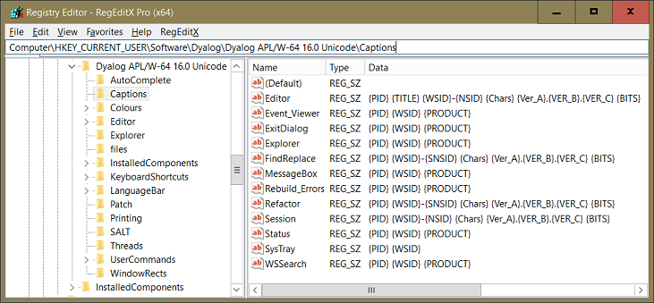
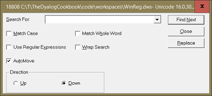

# Appendix 04: The development environment.

## Configure your session

Most developers insist of twisting the development environment in one way or another:

* Make your favourite utilities available from within `⎕SE`.
* Add a menu to the session with often used commands.
* Define some function keys carrying out often used commands (not applicable with Ride).

There are several ways to achieve that:

1. Modify and save a copy of the default session file (by default `def_{counntryCode}.dse` in the installation directory) and twist the configuration so that this new DSE is loaded. 
1. Modify and save a copy of the build workspace (typically something like `"C:\Program Files\Dyalog\...\ws\buildse.dws"`) and use it to create your own tailored version of a DSE.

Both have their own problems, the most obvious being that with a new version of Dyalog you start from scratch. However, there is a better way: save a function `Setup` in either `C:\Users\{UserName}\Documents\MyUCMDs\setup.dyalog` or one of the SALT work directories and it will be executed when...
* a new instance of Dyalog is fired up as part of the SALT boot process. 

  Note that the SALT boot process will be carried out even when the "Enable SALT callbacks" checkbox on the "SALT" tab of the "Configuration" dialog box is not ticked.
* the user command `]usetup` is issued. 

  This means that you can execute the function at will at any time in order to re-initialise your environment.

The function may be saved in that file either on its own or as part of a namespace.

I> You might expect that saving a class script "Setup.dyalog" with a public shared function `Setup` would work as well but it wouldn't.

A> ### SALT work directories
A>
A> You can check which folders are currently considered SALT work directories by issuing `]settings workdir ,/tmp/mydir`.
A>
A> You can add a folder `C:\Foo` with `]settings workdir ,C:\Foo`.

When called as part of the SALT boot process a right argument `'init'` will be passed. When called via `]usetup` then whatever is specified as argument to the user command will become the right argument of the `Setup` function.

The Dyalog manuals mention this feature only when discussing the user command `]usetup` but not anywhere near of how you can configure your environment; that's why we mention it here.

Note that if you want to debug any `Setup` function then the best way to do this is to make `⎕TRAP` a local variable of `Setup` and then add these lines at the top of the function:

~~~
[1] ⎕TRAP←0 'S'
[2] .
~~~

This will cause an error that stops execution because error trapping is switched off. This way you get around the trap that the SALT boot process uses to avoid `Setup` causing a hiccup. However, in case you change the function from the Tracer don't expect those changes to be saved automatically: you have to take care of that yourself.

The following code is an example for how you can put this mechanism to good use:

~~~
:Namespace Setup
⍝ Up to - and including - version 15.0 this script needs to go into:
⍝ "C:\Users\[username]\Documents\MyUCMDs"
⍝ Under 16.0 that still works but the SALT workdir folders are scanned as well.
  ⎕IO←1 ⋄ ⎕ML←1 

∇ {r}←Setup arg;myStuff
  r←⍬
  'MyStuff'⎕SE.⎕CY 'C:\MyStuff'
  ⎕SE.MyStuff.DefineMyFunctionKeys ⍬
  EstablishOnDropHandler ⍬
∇
   
∇ {r}←EstablishOnDropHandler dummy;events
  r←⍬
  events←''
  events,←⊂'Event' 'DropObjects' '⎕se.MyStuff.OnDrop'
  events,←⊂'Event' 'DropFiles' '⎕se.MyStuff.OnDrop'
  events,←⊂'AcceptFiles' 1
  events∘{⍵ ⎕WS ¨⊂⍺}'⎕se.cbbot.bandsb2.sb' '⎕se.cbbot.bandsb1.sb'
∇
   
:EndNamespace
~~~

We assume that in the workspace `MyStuff` there is a namespace `MyStuff` that contains at least two functions:

1. `DefineMyFunctionKeys`; this defines the function keys.
1. `OnDrop`; a handler that handles "DropObject" and "DropFiles" events on the session's status bar.

This is how the `OnDrop` function might look like:

~~~
OnDrop msg;⎕IO;⎕ML;files;file;extension;i;target
⍝ Handles files dropped onto the status bar.
 ⎕IO←1 ⋄ ⎕ML←1
 files←3⊃msg
 :For file :In files
     extension←1(819⌶)3⊃1 ⎕NPARTS file
     :Select extension
     :Case '.DWS'
         ⎕←'     )XLOAD ',{b←' '∊⍵ ⋄ (b/'"'),⍵,(b/'"')}file
     :Case '.DYALOG'
         :If 9=⎕NC'⎕SE.SALT'
             target←((,'#')≢,1⊃⎕NSI)/' -Target=',(1⊃⎕NSI),''''
             ⎕←'      ⎕SE.SALT.Load ''',file,'',target
         :EndIf
     :Else
         :If 'APLCORE'{⍺≡1(819⌶)(⍴⍺)↑⍵}2⊃⎕NPARTS file
             ⎕←'      )COPY ',{b←' '∊⍵ ⋄ (b/'"'),⍵,(b/'"')}file,'.'
         :Else
             :If ⎕NEXISTS file
                 ⎕←{b←' '∊⍵ ⋄ (b/'"'),⍵,(b/'"')}file
             :Else
                 ⎕←file
             :EndIf
         :EndIf
     :EndSelect
 :EndFor
~~~

What this handler does depends on what extension the file has:

* For `.dyalog` it writes a SALT load statement to the session. 

  If the current namespace is not `#` but, say, `Foo` then a `-target=Foo` is added.
* For `.dws` it writes an )XLOAD statement to the session.
* If the filename contains the string `aplcore` then it writes a )COPY statement for that aplcore to the session.
* For any other files the fully qualified filename is written to the session.

I> When you start Dyalog with Admin rights then it's not possible to drop files onto the status bar. That's because Microsoft considers drag'n drop too dangerous for admins. Funny; one would think it's a better strategyy to leave the dangerous stuff to the admins.

How you configure your development environment is of course very much a matter of personal preferences. However, you might consider to load a couple of scripts into `⎕SE` from within `Setup.dyalog`; the obvious candidates for this are `APLTreeUtils`, `FilesAndDirs`, `OS`, `WinSys`, `WinRegSimple` and `Events`. That would allow you to write user commands that can reference them with, say, `⎕SE.APLTreeUtils.Split`.

## Define your function keys

Defining function keys is of course not exactly a challenge. Implementing it in a way that is actually easy to read and maintain _is_ a challenge.

~~~
:Namespace FunctionKeyDefinition

    ∇ {r}←DefineFunctionKeys dummy;⎕IO;⎕ML
      ⎕IO←1 ⋄ ⎕ML←3
      r←⍬
      ⎕SHADOW⊃list←'LL' 'DB' 'DI' 'ER' 'LC' 'DC' 'UC' 'RD' 'RL' 'RC' 'Rl' 'Ll' 'CP' 'PT' 'BH'
      ⍎¨{⍵,'←⊂''',⍵,''''}¨list
      r⍪←'F01'('')('(Reserved for help)')
      r⍪←'F02'(')WSID',ER)(')wsid')
      r⍪←'F03'('')('Show next hit')                  ⍝ Reserved for NX
      r⍪←'F04'('⎕SE.Display ')('Call "Display"')
      r⍪←'F05'(LL,'→⎕LC+1 ⍝ ',ER)('→⎕LC+1')
      r⍪←'F06'(LL,'→⎕LC ⍝',ER)'→⎕LC'
      ...
:EndNamespace
~~~

This approach first defines all special shortcuts -- like `ER` for <enter> etc. -- as local variables; using `⎕SHADOW` avoids the need for maintaining a long list of local variables. The statement `⍎¨{⍵,'←⊂''',⍵,''''}¨list` assigns every name as an enclosed text string to itself like `ER←⊂'ER'`. Now we can use `ER` rather than `(⊂'ER)` which improves readability.

A definition like `LL,'→⎕LC ⍝',ER` reads as follows:

* `LL` positions the cursor to the very left of the current line.
* `→⎕LC ⍝` is then written to the session, meaning that everything that was already on that line is now on the right of the `⍝` and therefore has no effect.
* `ER` then executes <enter>, meaning that the statement is actually executed.

## Windows captions

If you always run just one instance of the interpreter you can safely ignore this. 

If on the other hand you run occasionally (let alone often) more than one instance of Dyalog in parallel then you are familiar with how it feels when all of a sudden an unexpected dialog box pops up, be it an aplcore or a message box asking "Are you sure?" when you have no idea what you are expected to be sure about, or which instance has just crashed. There is a way to get around this. With version 14.0 windows captions became configurable [^DyalogCaptions]. We suggest to you configure Windows captions in a particular way in order to overcome this problem.

The following screen shot shows the definitions for all windows captions in the Windows Registry for version 16 in case you follow our suggestions:

Notes:

* All definitions start with `{PID}` which stands for process ID. That allows you to identify which process a particular window belongs to, and even to kill that process if needs must.
* All definitions contain `{WSID}` which stands for the workspace ID.
* `{PRODUCT}` tells all about the version of Dyalog: version number, 32/64 and Classic/Unicode.

The other pieces of information are less important. For details refer to [^DyalogCaptions]. These definitions make sure that literally any dialog box can be allocated to a particular Dyalog session with ease. This is just an example:

However, this cannot be configured in any way, you need to add subkeys and values to the Windows Registry. We do _not_ suggest that you add or modify those caption with the Registry Editor. It is a better idea to write them by program, even if you deal with just one version of Dyalog at a time because soon there will be a new version coming along requiring you to carry out the same actions again. See the chapter "The Windows Registry" for how to solve this once and for all.

[^DyalogCaptions]: Dyalog's windows captions are configurable:
<http://help.dyalog.com/16.0/Content/UserGuide/Installation%20and%20Configuration/Window%20Captions.htm>