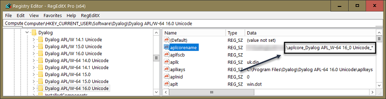

# Workspace integrity, corruptions and aplcores

The _workspace_ (WS) is where the APL interpreter manages all code and all data in memory. The Dyalog tracer / debugger has extensive edit-and-continue capabilities; the downside is that these have been known to occasionally corrupt the workspace. However, there are many other ways how the workspace may get corrupted:

* The interpreter might carry a bug.
* The user uses `⎕NA` incorrectly.

The interpreter checks WS integrity every now and then; how often can be influenced by setting certain debug flags; see "The APL Command Line" in the documentation for details. Be warned that...

* the `-DW` flag slows an application down significantly even on very fast machines.
* `-Dc` and `-Dw` slow the interpreter down in any case, but the effect depends on the workspace size. You might not notice anything at all with, say, maxws=64MB but you will notice a significant delay with maxws=2GB.

When the interpreter finds that the WS is damaged it will create a dump file called "aplcore" and exit in order to prevent your application from producing (or storing) incorrect results.

Regularly rebuilding the workspace from source files removes the risk of accumulating damage to the binary workspace.

Note that an aplcore is useful in two ways: 

* You can copy from it. It's not a good idea to copy the whole thing though; something has been wrong with it after all. 

  It may be fine to recover a particular object (or some objects) from it, although you would be advised to rebuild recovered objects from the source (for example via the clipboard) rather than using binary data recovered from an aplcore. Add a colon: 

 ~~~
       )copy aplcore. myObj
 ~~~

* Send the aplcore to Dyalog. It's kind of a dump, so they might be able to determine the cause of the problem. Naturally it helps when you can provide information about your last actions or, even better, reproduce the aplcore at will.

You can create an aplcore deliberately by executing:

~~~
      2 ⎕NQ '.' 'dumpws' 'C:\MyAplcore'
~~~

This might be a useful thing to do just before executing a line you already know will cause havoc.

In order to create a "real" aplcore in the sense of corrupting the workspace this will do:

~~~
 Crash;MEMCPY
 :Trap 102
     ⎕NA'dyalog32|MEMCPY u4 u4 u4'
 :Else
     ⎕NA'dyalog64|MEMCPY u4 u4 u4'
 :EndTrap
 MEMCPY 0 0 4
 ~~~
 
 By default an aplcore is saved with the name `aplcore` in what is at that moment the current directory. This is not nice because it means that any aplcore might overwrite the last one. That can become particularly annoying when you try to copy from an aplcore with :
 
 ~~~
       )copy C:\MyAplcore.
 ~~~
 
 but this might actually create another aplcore, overwriting the first one. Now it might well be too late to restrict the attempt to copy to what is most important to you: the object or objects you have worked on most recently. 
 
 I> If the aplcore is saved at all that is, because if the current directory is something like `C:\Program files\` then you won't have the right to save into this directory anyway.
 
 For that reason it is highly recommended to set the value `aplcorename` in the Windows Registry:

 
 
 This means that aplcores...

* are going to be saved in a particular folder.
* start their names with `aplcore_Dyalog APL_W-64 16_0 Unicode_`.
* will be numbered starting from 1; this as achieved by adding the trailing `*`.