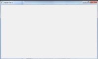

{:: encoding="utf-8" /}

# User interface 

Modern graphical user interfaces (GUIs, or more simply, UIs) are a wonder. UI conventions are so widely known it is now unremarkable for people to start using applications without prior training, expecting the software to make clear what they need to do. 

This is a high standard to meet, and writing UIs is a deep art. The primary platforms for professional writers of UIs are currently Windows Presentation Foundation (WPF) and a combination of HTML 5 and JavaScript (HTML/JS). These are rich platforms, which enable effective and attractive UIs to be written. 

The high quality of these UIs is particularly important for mass-market software, where users are unskilled and unsupported. 

WPF and HTML/JS have a high learning threshold. There is much to be mastered before you can write good UIs on these platforms. 

You have an alternative. The GUI tools native to Dyalog support perfectly workmanlike GUIs. They exploit and extend your existing knowledge of Dyalog. If you are producing high-value software for a few users, rather than software for casual use by millions, a native Dyalog GUI might be your best platform.

Creating a GUI form in Dyalog could hardly be simpler:

      f←⎕NEW⊂'Form'
      f.Caption←'Hello world'

To the form we add controls, set callback functions to run when certain events occur, and invoke the form's `Wait` method. See the _Dyalog for Microsoft Windows Interface Guide_ for details and tutorials. 

## Navigating the UI

Embedding a form into an application raises more difficult questions. Chief among them is where to put the form. 

It is common for a callback to read or set other controls in the UI. The question is: how to find them? Callback functions always receive in their arguments a reference to the UI control that triggered the callback. How to navigate the UI's hierarchy (tree) of controls? 

Keep in mind the following common practices we'll want to accommodate.

* A single callback function is often used to handle an event or events for several controls. 
* It is common during development or maintenance to redesign parts of the UI. If you think of the UI as a tree rooted in its form, redesign can move entire branches of the tree. 
* We might want multiple instances of the same form. For example, if the form allows us to browse a customer record, we might want two records open at the same time. 

Here are some strategies for embedding and navigating the UI tree. 

### Make the form a child of the workspace root

This is the method used above: `f←⎕NEW⊂'Form'`. The object `f` is a child of the workspace root. It's the strategy implied by the interface tutorials. It's easy to read and understand:

    f.(MB←⎕NEW⊂'Menubar')
    f.MB.(MenuFile←⎕NEW⊂'Menu'('Caption' '&File'))

Notice that the `⎕NEW` that creates each control is executed within its parent. This constructs the UI tree. Notice too that the control is given a name within its parent. So, for example, we can refer to the File menu as `f.MB.MenuFile`. This is clear enough, but it embeds the structure of the UI into the name of each control. So if we want to move a branch of the UI tree we have to find and edit every reference to controls in that branch. 

If we want multiple instances of the form, we will need `f` to be a reference to a form, not the name of the form in the workspace root, eg

    f←CreateGui f←CustomerForms,←⎕NEW⊂'Form'

### Give the UI a namespace in the root 

This is only the slightest of improvements 

### Navigate by searching the UI tree 

### Assign unique names to controls

## A simple UI with native Dyalog forms

### Forms

### Controls

### Callbacks and the event queue

### Extended controls

